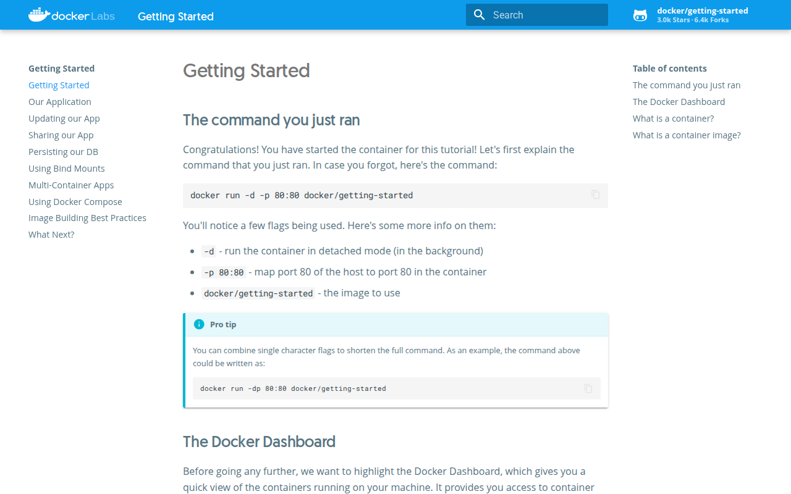
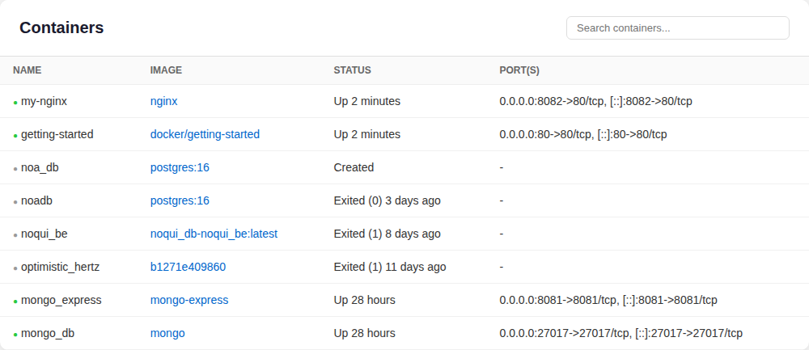
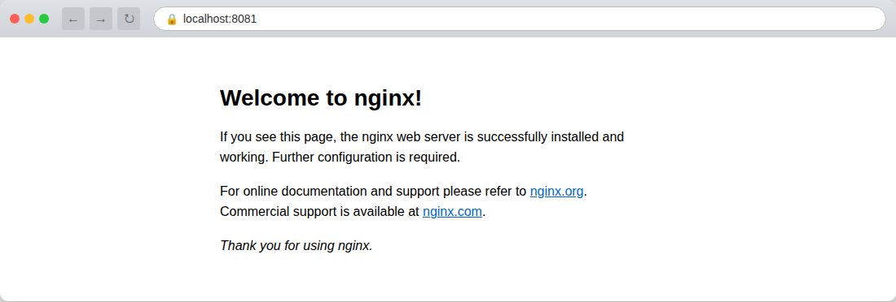
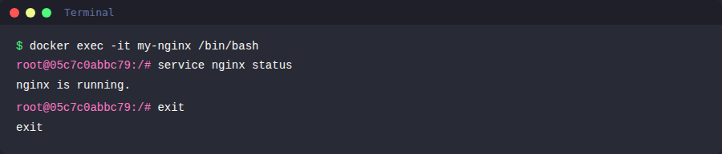
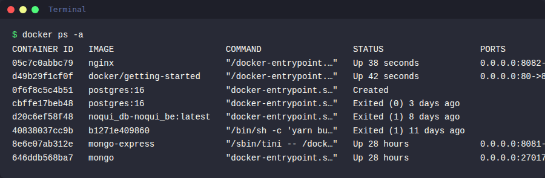
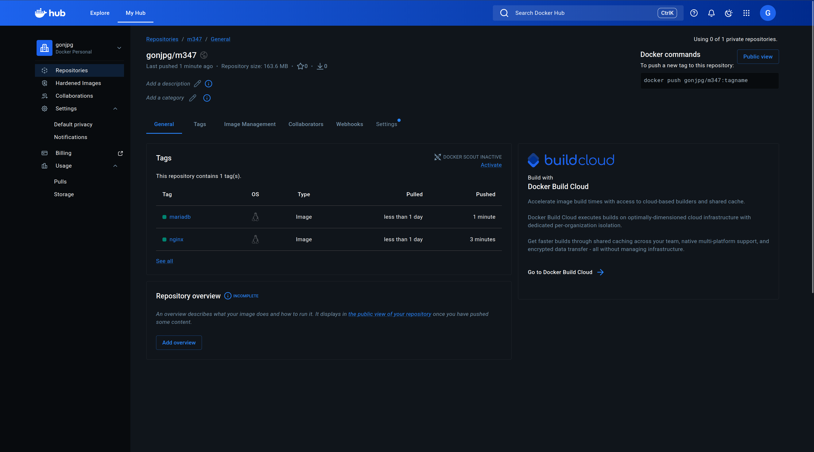
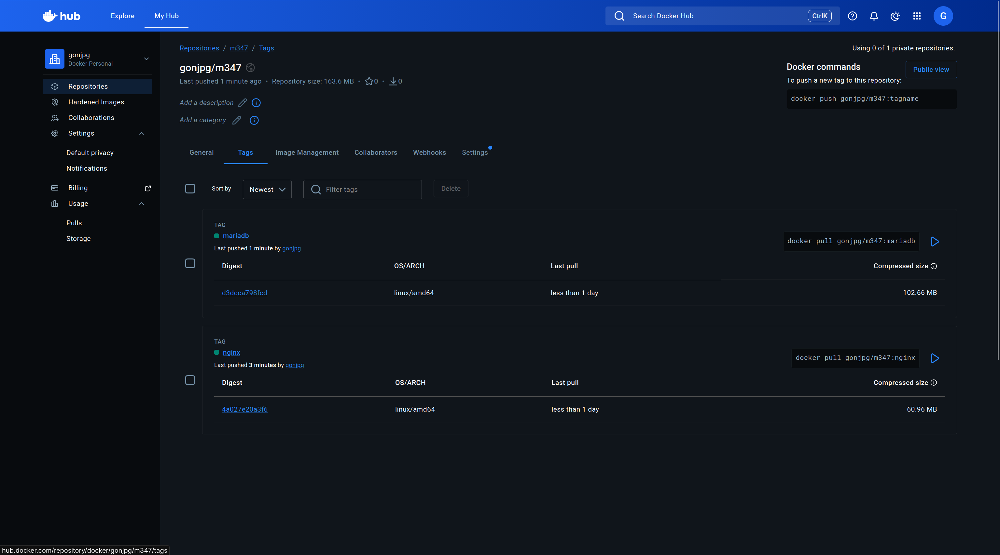

# KN01: Docker Grundlagen

## A) Installation (20%)

### Docker Installation

Docker wurde auf meinem System installiert. Die Installation umfasste folgende Schritte:

1. Docker von der offiziellen Webseite heruntergeladen: [https://www.docker.com/products/docker-desktop/](https://www.docker.com/products/docker-desktop/)
2. Die Installationsdatei ausgeführt und den Anweisungen gefolgt
3. Docker gestartet und den ersten Container erstellt mit:

```bash
docker run -d -p 80:80 docker/getting-started
```

4. Die Webseite unter `http://localhost` aufgerufen

### Abgaben

**Screenshot der Webseite nach dem Erstellen des ersten Containers:**



**Screenshot des Containers in Docker Desktop:**



---

## B) Docker Command Line Interface (CLI) (50%)

### 1. Docker-Version überprüfen

```bash
docker --version
```

**Ausgabe:**

```
Docker version 28.2.2, build 28.2.2-0ubuntu1~24.04.1
```

---

### 2. Docker Images suchen

**Ubuntu Image suchen:**

```bash
docker search ubuntu
```

**Ausgabe:**

```
NAME                             DESCRIPTION                                     STARS     OFFICIAL
ubuntu                           Ubuntu is a Debian-based Linux operating sys…   17789     [OK]
ubuntu/squid                     Squid is a caching proxy for the Web. Long-t…   124
ubuntu/nginx                     Nginx, a high-performance reverse proxy & we…   139
ubuntu/cortex                    Cortex provides storage for Prometheus. Long…   4
ubuntu/bind9                     BIND 9 is a very flexible, full-featured DNS…   117
...
```

**Nginx Image suchen:**

```bash
docker search nginx
```

**Ausgabe:**

```
NAME                                     DESCRIPTION                                     STARS     OFFICIAL
nginx                                    Official build of Nginx.                        21191     [OK]
nginx/nginx-ingress                      NGINX and  NGINX Plus Ingress Controllers fo…   114
nginx/nginx-prometheus-exporter          NGINX Prometheus Exporter for NGINX and NGIN…   50
nginx/unit                               This repository is retired, use the Docker o…   66
...
```

Die Ergebnisse zeigen verschiedene Images mit Name, Beschreibung, Stars, und ob es ein offizielles Image ist. Die offiziellen Images sind mit `[OK]` in der Spalte "OFFICIAL" gekennzeichnet.

---

### 3. Erklärung des Befehls `docker run -d -p 80:80 docker/getting-started`

| Parameter | Erklärung |
|-----------|-----------|
| `docker run` | Erstellt und startet einen neuen Container aus einem Image. Kombiniert `docker pull`, `docker create` und `docker start` in einem Befehl. |
| `-d` | **Detached mode** - Der Container läuft im Hintergrund. Das Terminal wird nicht blockiert und man kann weitere Befehle eingeben. |
| `-p 80:80` | **Port-Mapping** - Verbindet Port 80 des Host-Systems (links) mit Port 80 des Containers (rechts). Dadurch ist der Container über `http://localhost:80` erreichbar. |
| `docker/getting-started` | Der Name des Docker-Images, das verwendet wird. Es wird von Docker Hub heruntergeladen, falls es lokal nicht vorhanden ist. |

---

### 4. Nginx Image - Pull, Create, Start

Wir zeigen, dass der Befehl `docker run` das gleiche ist wie `docker pull`, `docker create` und `docker start` hintereinander ausgeführt.

#### 4.1 Image herunterladen

```bash
docker pull nginx
```

**Ausgabe:**

```
Using default tag: latest
latest: Pulling from library/nginx
0c8d55a45c0d: Already exists
46bf3a120c8e: Pull complete
4f4efe02d542: Pull complete
7b6cb8ccac7b: Pull complete
f73400a233fd: Pull complete
47cd406a84ef: Pull complete
bae5a1799a80: Pull complete
Digest: sha256:341bf0f3ce6c5277d6002cf6e1fb0319fa4252add24ab6a0e262e0056d313208
Status: Downloaded newer image for nginx:latest
docker.io/library/nginx:latest
```

#### 4.2 Container erstellen

```bash
docker create -p 8081:80 --name my-nginx nginx
```

**Ausgabe:**

```
966e156d70f4b0ab6b0d95cd03f9874025a8b53d14d314c33ea011ab21e4f5ba
```

**Erklärung:**
- `docker create` erstellt einen Container, startet ihn aber **nicht**
- `-p 8081:80` mappt Port 8081 des Hosts auf Port 80 des Containers
- `--name my-nginx` gibt dem Container einen benutzerfreundlichen Namen
- `nginx` ist das zu verwendende Image
- Die Ausgabe ist die Container-ID

#### 4.3 Container starten

```bash
docker start my-nginx
```

Falls der Port 8081 bereits belegt ist, muss der andere Container zuerst gestoppt werden:

```bash
docker stop <container-name>
docker start my-nginx
```

#### 4.4 Nginx Standard-Seite

Nach dem Start ist die Nginx-Willkommensseite unter `http://localhost:8081` erreichbar.

**Screenshot der Nginx Standard-Seite (URL sichtbar):**



---

### 5. Ubuntu Image - Hintergrund vs. Interaktiv

#### 5.1 Ubuntu im Detached Mode

```bash
docker run -d ubuntu
```

**Ausgabe:**

```
Unable to find image 'ubuntu:latest' locally
latest: Pulling from library/ubuntu
01d7766a2e4a: Pull complete
Digest: sha256:d1e2e92c075e5ca139d51a140fff46f84315c0fdce203eab2807c7e495eff4f9
Status: Downloaded newer image for ubuntu:latest
d2c6df3ddf9e6dc64a965298afdf973e22893f0752f22c9f07d63bd709469d30
```

**Beobachtung:**

Das Ubuntu-Image wurde automatisch von Docker Hub heruntergeladen, da es lokal nicht vorhanden war (`Unable to find image 'ubuntu:latest' locally`). Der Container wurde erstellt und gestartet, hat sich aber sofort wieder beendet. Das liegt daran, dass das Ubuntu-Image keinen laufenden Prozess (Daemon) im Vordergrund hat. Ein Container läuft nur so lange, wie sein Hauptprozess aktiv ist. Da Ubuntu standardmässig nur eine Shell (`/bin/bash`) startet und diese im Detached-Mode keinen Input erhält, beendet sich der Container sofort. Mit `docker ps` sieht man, dass der Container nicht mehr läuft, aber mit `docker ps -a` sieht man ihn im Status "Exited (0)".

```bash
docker ps -a --filter "ancestor=ubuntu"
```

```
CONTAINER ID   IMAGE    COMMAND       CREATED         STATUS                     PORTS   NAMES
d2c6df3ddf9e   ubuntu   "/bin/bash"   4 seconds ago   Exited (0) 3 seconds ago           musing_driscoll
```

#### 5.2 Ubuntu im Interaktiven Modus

```bash
docker run -it ubuntu
```

**Beobachtung:**

Mit den Flags `-it` wird der Container im interaktiven Modus gestartet. `-i` steht für "interactive" und hält den STDIN (Standard Input) offen, `-t` alloziert ein Pseudo-Terminal. Dadurch öffnet sich eine interaktive Bash-Shell innerhalb des Containers. Man befindet sich nun als `root`-Benutzer im Container und kann Befehle ausführen, als wäre man auf einem echten Ubuntu-System. Das Image wurde nicht erneut heruntergeladen, da es bereits lokal vorhanden war. Der Container bleibt so lange aktiv, wie die Shell-Sitzung geöffnet ist. Beim Eingeben von `exit` wird die Shell und damit auch der Container beendet.

---

### 6. Interaktive Shell in laufendem Nginx-Container

Sicherstellen, dass der Nginx-Container bereits läuft:

```bash
docker ps
```

Interaktive Shell öffnen:

```bash
docker exec -it my-nginx /bin/bash
```

**Erklärung:**
- `docker exec` führt einen Befehl in einem **bereits laufenden** Container aus (im Unterschied zu `docker run -it`, das einen neuen Container startet)
- `-it` aktiviert den interaktiven Modus mit Terminal
- `my-nginx` ist der Name des Containers
- `/bin/bash` startet eine Bash-Shell

#### 6.1 Nginx-Status prüfen

Innerhalb des Containers:

```bash
root@f29eed1defdf:/# service nginx status
nginx is running.
```

**Screenshot des Befehls und Resultats:**



Man sieht, dass Nginx innerhalb des Containers aktiv läuft. Man kann sich frei im Dateisystem des Containers bewegen.

#### 6.2 Shell beenden

```bash
root@f29eed1defdf:/# exit
```

**Wichtig:** Nach dem `exit` wird nur die Shell-Sitzung beendet, **nicht** der Container selbst. Der Nginx-Container läuft weiterhin im Hintergrund. Das ist der Unterschied zu `docker run -it`: Bei `docker exec` wird nur ein zusätzlicher Prozess im Container beendet, der Hauptprozess (Nginx) läuft weiter.

---

### 7. Status der Container überprüfen

```bash
docker ps -a
```

**Ausgabe:**

```
CONTAINER ID   IMAGE    COMMAND                  CREATED          STATUS                      PORTS                                       NAMES
d2c6df3ddf9e   ubuntu   "/bin/bash"              14 seconds ago   Exited (0) 13 seconds ago                                               musing_driscoll
f29eed1defdf   nginx    "/docker-entrypoint.…"   32 seconds ago   Up 30 seconds               0.0.0.0:8082->80/tcp, [::]:8082->80/tcp     my-nginx
```

Dieser Befehl zeigt alle Container (laufend und gestoppt) mit Status, Ports, Namen etc.

**Screenshot des Befehls und Resultats:**



---

### 8. Nginx-Container stoppen

```bash
docker stop my-nginx
```

---

### 9. Alle Container entfernen

```bash
docker rm my-nginx musing_driscoll
```

**Erklärung:**
- `docker rm` entfernt gestoppte Container
- Man kann mehrere Container-Namen oder IDs angeben

Alternativ kann man alle Container auf einmal entfernen:

```bash
docker rm $(docker ps -aq)
```

---

### 10. Images entfernen

```bash
docker rmi nginx ubuntu
```

**Ausgabe:**

```
Untagged: nginx:latest
Untagged: nginx@sha256:341bf0f3ce6c5277d6002cf6e1fb0319fa4252add24ab6a0e262e0056d313208
Deleted: sha256:5cdef4ac3335f68428701c14c5f12992f5e3669ce8ab7309257d263eb7a856b1
...
Untagged: ubuntu:latest
Untagged: ubuntu@sha256:d1e2e92c075e5ca139d51a140fff46f84315c0fdce203eab2807c7e495eff4f9
Deleted: sha256:bbdabce66f1b7dde0c081a6b4536d837cd81dd322dd8c99edd68860baf3b2db3
...
```

**Erklärung:**
- `docker rmi` entfernt Images von der lokalen Umgebung
- Man kann mehrere Images gleichzeitig angeben

---

### Zusammenfassung aller Befehle (Teil B)

```bash
# 1. Version
docker --version

# 2. Images suchen
docker search ubuntu
docker search nginx

# 3. (Erklärung - siehe oben)

# 4. Nginx: Pull, Create, Start
docker pull nginx
docker create -p 8081:80 --name my-nginx nginx
docker start my-nginx

# 5. Ubuntu
docker run -d ubuntu
docker run -it ubuntu

# 6. Interaktive Shell
docker exec -it my-nginx /bin/bash
service nginx status
exit

# 7. Status prüfen
docker ps -a

# 8. Container stoppen
docker stop my-nginx

# 9. Alle Container entfernen
docker rm my-nginx musing_driscoll

# 10. Images entfernen
docker rmi nginx ubuntu
```

---

## C) Registry und Repository (10%)

### Docker Hub Account erstellen

1. Auf [Docker Hub](https://hub.docker.com) mit der TBZ-Email (`goncalo.dealmeida@edu.tbz.ch`) einen Account erstellt
2. Benutzername: **gonjpg**
3. Ein **privates** Repository mit dem Namen **m347** erstellt
4. Die Namensform für das Repository ist: `gonjpg/m347`

### Docker Desktop Login

In Docker Desktop mit dem neuen Docker Hub Benutzer eingeloggt:

```bash
docker login -u gonjpg
```

### Abgabe

**Screenshot des leeren Repositories:**



---

## D) Privates Repository (20%)

### 1. Nginx Image taggen

Zuerst das Nginx-Image erneut herunterladen:

```bash
docker pull nginx
```

Dann das Image in das eigene Repository "kopieren" (taggen):

```bash
docker tag nginx:latest gonjpg/m347:nginx
```

**Erklärung:**
- `docker tag` erstellt einen neuen Tag (Verweis/Alias) für ein bestehendes Image
- `nginx:latest` ist das Quell-Image mit dem Tag `latest`
- `gonjpg/m347:nginx` ist der neue Tag im Format `Benutzername/Repository:Tag`
- Das Image wird dabei **nicht** kopiert - es wird lediglich ein zusätzlicher Name/Tag für dasselbe Image erstellt
- **Was ist ein Tag?** Ein Tag ist ein Label/Bezeichner, der auf eine bestimmte Version eines Images verweist. Tags werden häufig für Versionierung verwendet (z.B. `nginx:1.25`, `nginx:latest`). In unserem Fall verwenden wir Tags, um verschiedene Applikationen in einem Repository zusammenzufassen.

---

### 2. Image pushen

```bash
docker push gonjpg/m347:nginx
```

**Erklärung:**
- `docker push` lädt ein lokales Image in ein Remote-Repository (Docker Hub) hoch
- `gonjpg/m347:nginx` gibt an, wohin das Image gepusht wird:
  - `gonjpg` = Docker Hub Benutzername
  - `m347` = Repository-Name
  - `nginx` = Tag des Images
- Voraussetzung ist, dass man mit `docker login` eingeloggt ist und Schreibrechte auf das Repository hat

---

### 3. MariaDB Image taggen

```bash
docker pull mariadb
docker tag mariadb:latest gonjpg/m347:mariadb
```

---

### 4. MariaDB Image pushen

```bash
docker push gonjpg/m347:mariadb
```

---

### Zusammenfassung aller Befehle (Teil D)

```bash
# Nginx Image herunterladen und taggen
docker pull nginx
docker tag nginx:latest gonjpg/m347:nginx
docker push gonjpg/m347:nginx

# MariaDB Image herunterladen und taggen
docker pull mariadb
docker tag mariadb:latest gonjpg/m347:mariadb
docker push gonjpg/m347:mariadb
```

### Abgabe

**Screenshot der Docker Hub Seite mit den sichtbaren Tags:**


