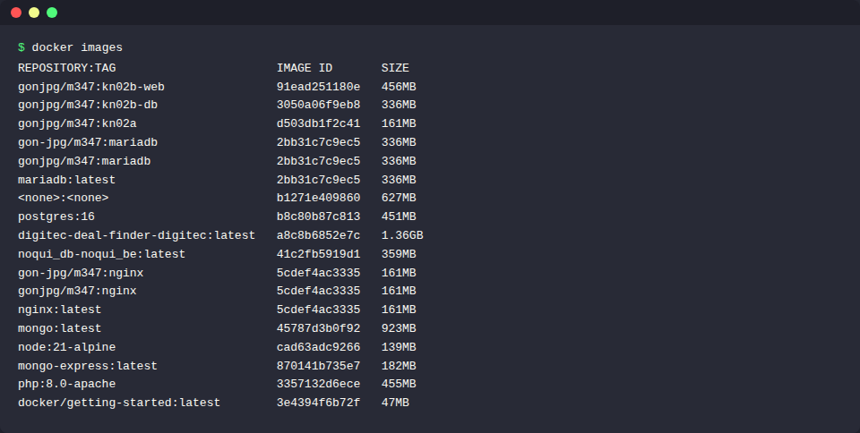
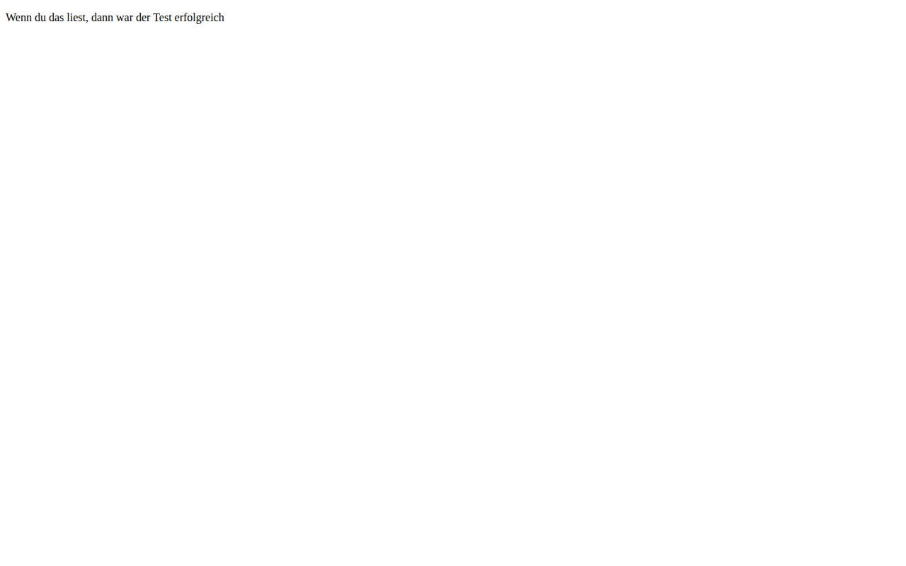
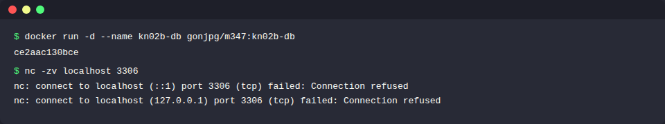
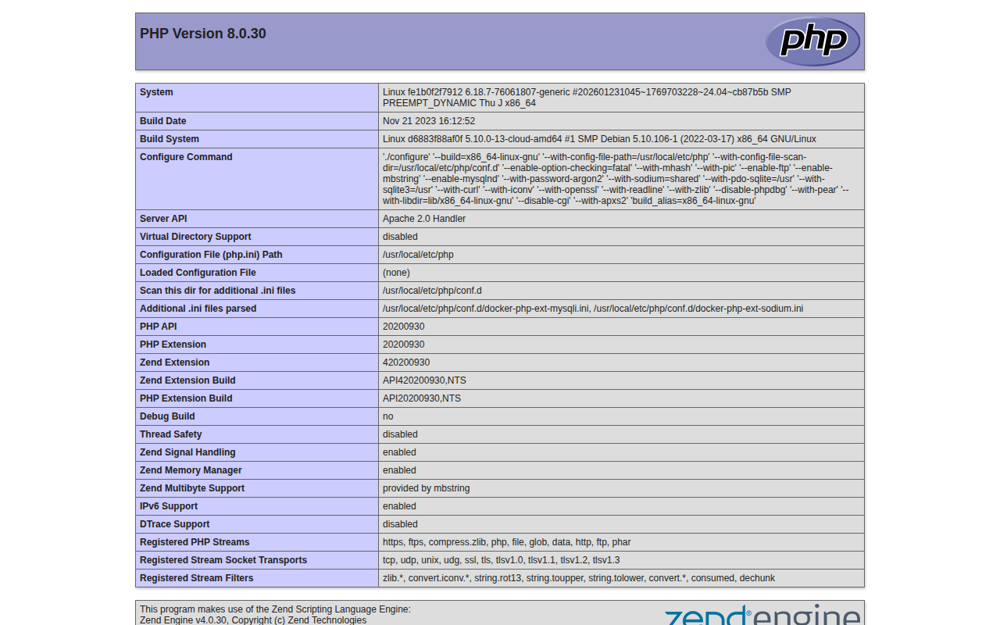
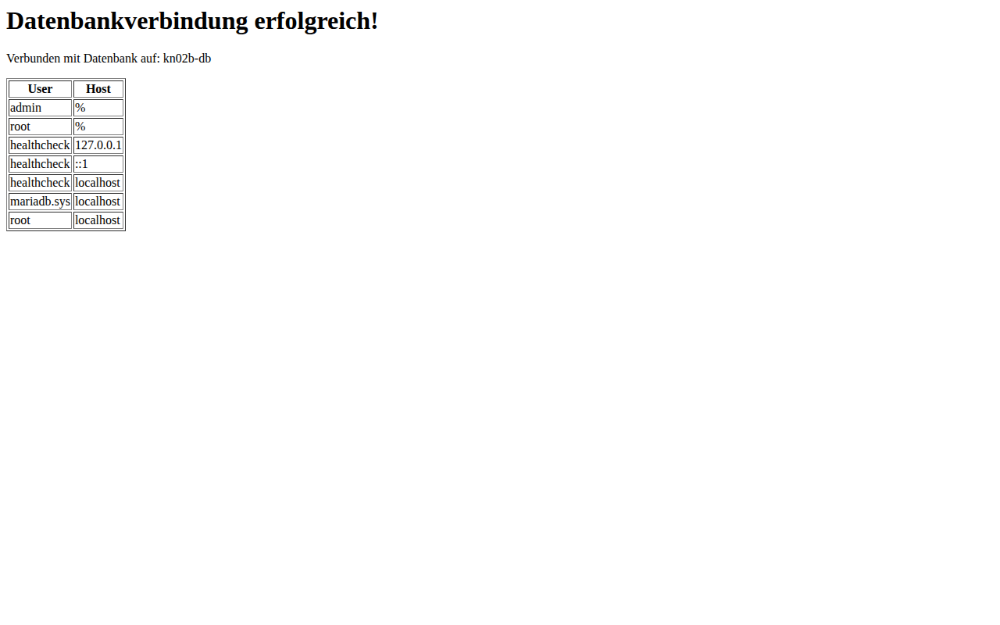

# KN02: Dockerfile

## A) Dockerfile I

### Dokumentation des vorgegebenen Dockerfiles

```dockerfile
FROM nginx                                    # Verwendet das offizielle nginx Image als Basis-Layer
COPY static-html-directory /var/www/html      # Kopiert einen lokalen Ordner in den Container-Pfad /var/www/html
EXPOSE 80                                     # Exponiert Port 80 nach aussen (HTTP)
```

**Erklärung der einzelnen Zeilen:**
- `FROM nginx` - Definiert das Basis-Image. Alle weiteren Anweisungen bauen auf diesem Image auf.
- `COPY static-html-directory /var/www/html` - Kopiert Dateien vom Host in den Container. Der erste Pfad ist lokal, der zweite ist im Container.
- `EXPOSE 80` - Dokumentiert, dass der Container auf Port 80 hört. Muss beim `docker run` mit `-p` gemappt werden.

---

### Angepasstes Dockerfile (kn02a)

Nginx speichert HTML-Dateien unter `/usr/share/nginx/html`. Mit `WORKDIR` setzen wir diesen Pfad als Arbeitsverzeichnis, sodass `COPY` keinen absoluten Pfad braucht.

```dockerfile
FROM nginx
WORKDIR /usr/share/nginx/html
COPY helloworld.html .
EXPOSE 80
```

### helloworld.html

```html
<!DOCTYPE html>
<html>
    <head>
        <title>hello world</title>
    </head>
    <body>
        <p>Wenn du das liest, dann war der Test erfolgreich</p>
    </body>
</html>
```

### Docker Befehle

```bash
# Image bauen mit Tag für Docker Hub
docker build -t gonjpg/m347:kn02a ./kn02a

# Container starten
docker run -d -p 8083:80 --name kn02a gonjpg/m347:kn02a

# Image in privates Repository pushen
docker push gonjpg/m347:kn02a
```

### Abgaben

**Screenshot Docker Images (kn02a sichtbar):**



**Screenshot der helloworld.html Seite:**



---

## B) Dockerfile II

### DB-Container (MariaDB)

#### Dockerfile kn02b-db

```dockerfile
FROM mariadb

ENV MYSQL_ROOT_PASSWORD=rootpassword
ENV MYSQL_DATABASE=mysql
ENV MYSQL_USER=admin
ENV MYSQL_PASSWORD=admin

EXPOSE 3306
```

**Erklärung:**
- `FROM mariadb` - Basis-Image von Docker Hub
- `ENV` - Setzt Umgebungsvariablen direkt im Dockerfile, statt sie beim `docker run` mitzugeben
- `EXPOSE 3306` - Standardport von MariaDB/MySQL

#### Docker Befehle (DB)

```bash
docker build -t gonjpg/m347:kn02b-db ./kn02b-db
docker run -d --name kn02b-db gonjpg/m347:kn02b-db
docker push gonjpg/m347:kn02b-db
```

**Screenshot: Telnet/NC Verbindung auf DB-Port 3306:**



---

### Web-Container (PHP + Apache)

#### Dockerfile kn02b-web

```dockerfile
FROM php:8.0-apache

WORKDIR /var/www/html

COPY info.php .
COPY db.php .

RUN docker-php-ext-install mysqli

EXPOSE 80
```

**Erklärung:**
- `FROM php:8.0-apache` - PHP 8.0 mit integriertem Apache Webserver (Variante aus Docker Hub)
- `WORKDIR /var/www/html` - Apache-Webroot, hier liegen die PHP-Dateien
- `RUN docker-php-ext-install mysqli` - Installiert das mysqli PHP-Modul für Datenbankverbindungen
- `EXPOSE 80` - HTTP-Port

#### info.php

```php
<?php
phpinfo();
?>
```

#### db.php

```php
<?php
$servername = "kn02b-db";
$username = "root";
$password = "rootpassword";
$dbname = "mysql";

$conn = new mysqli($servername, $username, $password, $dbname);

if ($conn->connect_error) {
    die("Connection failed: " . $conn->connect_error);
}

echo "<h1>Datenbankverbindung erfolgreich!</h1>";
echo "<p>Verbunden mit Datenbank auf: " . $servername . "</p>";

$sql = "SELECT User, Host FROM mysql.user";
$result = $conn->query($sql);

if ($result->num_rows > 0) {
    echo "<table border='1'><tr><th>User</th><th>Host</th></tr>";
    while($row = $result->fetch_assoc()) {
        echo "<tr><td>" . $row["User"] . "</td><td>" . $row["Host"] . "</td></tr>";
    }
    echo "</table>";
}
$conn->close();
?>
```

**Erklärung zu `$servername = "kn02b-db"`:** Der Container-Name `kn02b-db` wird als Hostname verwendet, weil beim `docker run` mit `--link kn02b-db:kn02b-db` ein DNS-Eintrag im Web-Container erstellt wird. So können die Container über den Namen kommunizieren.

#### Docker Befehle (Web)

```bash
docker build -t gonjpg/m347:kn02b-web ./kn02b-web
docker run -d -p 8084:80 --name kn02b-web --link kn02b-db:kn02b-db gonjpg/m347:kn02b-web
docker push gonjpg/m347:kn02b-web
```

**Erklärung `--link kn02b-db:kn02b-db`:** Der erste Teil ist der Container-Name, der zweite ist der Hostname/Alias im Web-Container. Damit kann `db.php` den DB-Container über den Namen `kn02b-db` erreichen.

### Abgaben

**Screenshot info.php:**



**Screenshot db.php:**


