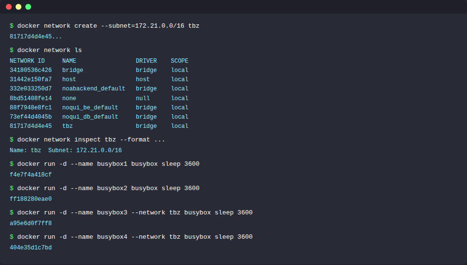
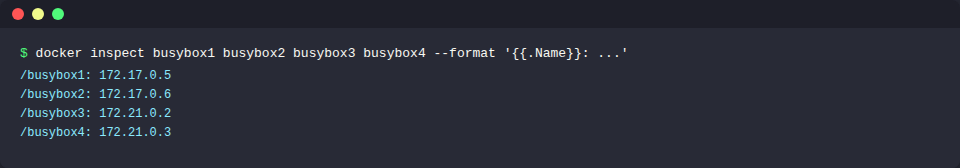
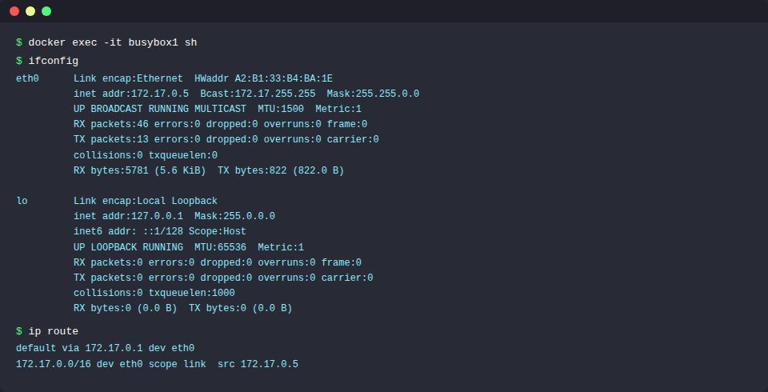
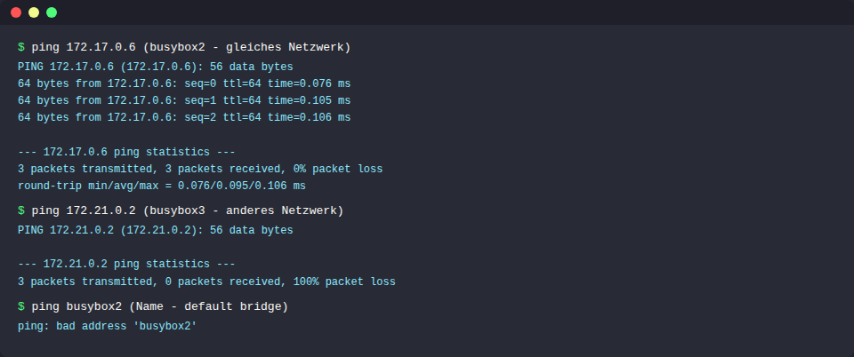
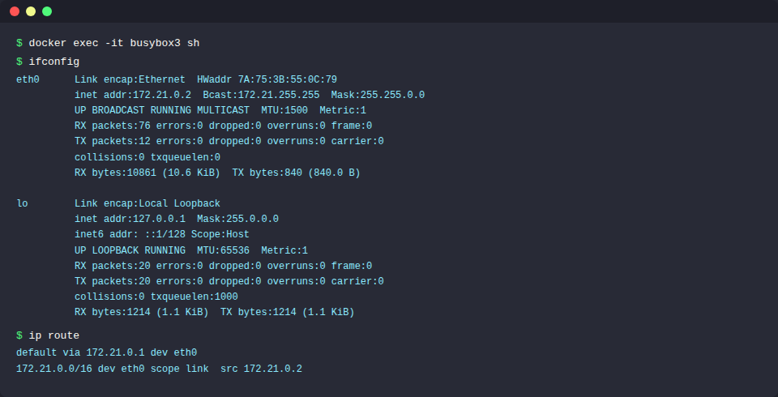
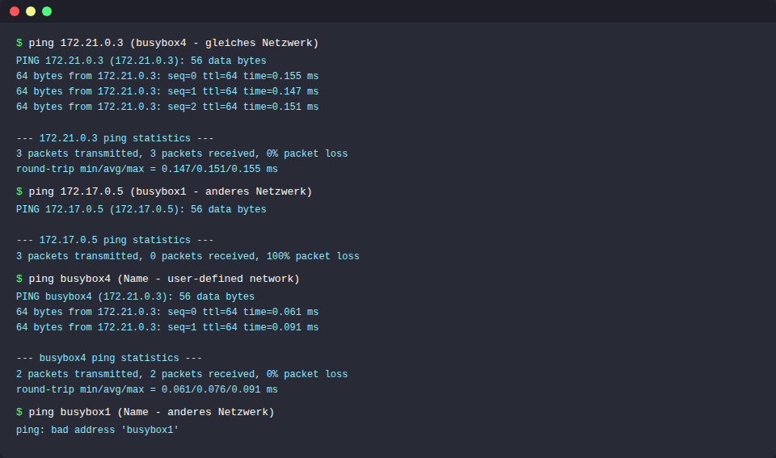

# KN03: Netzwerk, Sicherheit

## A) Eigenes Netzwerk (100%)

### Netzwerk-Setup

Vier busybox-Container werden erstellt:
- **busybox1** und **busybox2** im **default bridge** Netzwerk
- **busybox3** und **busybox4** im **user-defined** Netzwerk `tbz` (Subnet: 172.21.0.0/16)

```bash
# Eigenes Netzwerk erstellen
docker network create --subnet=172.21.0.0/16 tbz

# Container im default bridge Netzwerk
docker run -d --name busybox1 busybox sleep 3600
docker run -d --name busybox2 busybox sleep 3600

# Container im tbz Netzwerk
docker run -d --name busybox3 --network tbz busybox sleep 3600
docker run -d --name busybox4 --network tbz busybox sleep 3600
```

**Screenshot Netzwerk-Setup:**



### IP-Adressen der Container

```bash
docker inspect busybox1 busybox2 busybox3 busybox4 \
  --format '{{.Name}}: {{range .NetworkSettings.Networks}}{{.IPAddress}}{{end}}'
```

| Container | Netzwerk | IP-Adresse |
|-----------|----------|------------|
| busybox1 | default bridge (172.17.0.0/16) | 172.17.0.5 |
| busybox2 | default bridge (172.17.0.0/16) | 172.17.0.6 |
| busybox3 | tbz (172.21.0.0/16) | 172.21.0.2 |
| busybox4 | tbz (172.21.0.0/16) | 172.21.0.3 |

**Screenshot IP-Adressen:**



---

### Tests von busybox1 (default bridge)

```bash
docker exec -it busybox1 sh
```

**ifconfig und Default-Gateway:**

Der Default-Gateway von busybox1 ist **172.17.0.1** (der Docker-Bridge-Gateway).
busybox2 hat den gleichen Default-Gateway, da sie im gleichen Netzwerk sind.



**Ping-Tests:**



**Ergebnisse:**
- `ping 172.17.0.6` (busybox2, gleiches Netzwerk) → **Erfolgreich** (0% packet loss)
- `ping 172.21.0.2` (busybox3, anderes Netzwerk) → **Fehlgeschlagen** (100% packet loss)
- `ping busybox2` (Name, default bridge) → **Fehlgeschlagen** - Namen-Auflösung funktioniert nur in user-defined Netzwerken

---

### Tests von busybox3 (tbz Netzwerk)

```bash
docker exec -it busybox3 sh
```

**ifconfig und Default-Gateway:**

Der Default-Gateway von busybox3 ist **172.21.0.1** (Gateway des tbz-Netzwerks).
busybox4 hat den gleichen Default-Gateway.



**Ping-Tests:**



**Ergebnisse:**
- `ping 172.21.0.3` (busybox4, gleiches Netzwerk) → **Erfolgreich**
- `ping 172.17.0.6` (busybox1, anderes Netzwerk) → **Fehlgeschlagen**
- `ping busybox4` (Name, user-defined) → **Erfolgreich** - Automatisches DNS im user-defined Netzwerk
- `ping busybox1` (Name, anderes Netzwerk) → **Fehlgeschlagen** - `bad address 'busybox1'`

---

### Gemeinsamkeiten und Unterschiede

**Gemeinsamkeiten:**
- Container im gleichen Netzwerk können sich gegenseitig per IP erreichen
- Beide Netzwerke haben einen Gateway (Docker-Host)
- Container können nicht über Netzwerkgrenzen hinweg kommunizieren

**Unterschiede:**

| Eigenschaft | default bridge | user-defined (tbz) |
|-------------|---------------|---------------------|
| Namen-Auflösung | Nein | Ja (automatisches DNS) |
| Isolation | Alle Container teilen sich das Netzwerk | Explizit zugewiesen |
| Kontrolle | Begrenzt | Vollständig (Subnet, Gateway wählbar) |

**Schlussfolgerung:** User-defined Netzwerke bieten mehr Kontrolle und ermöglichen Container-Kommunikation über Namen. Im default bridge Netzwerk müssen IP-Adressen verwendet werden.

---

### Bezug zu KN02

**In welchem Netzwerk befanden sich die KN02-Container?**

Die Container `kn02b-db` und `kn02b-web` befanden sich im **default bridge** Netzwerk.

**Warum konnten sie miteinander reden?**

Durch den Parameter `--link kn02b-db:kn02b-db` beim `docker run` wurde ein spezieller Eintrag in der `/etc/hosts` Datei des Web-Containers erstellt. Dadurch konnte der Web-Container den DB-Container über den Namen `kn02b-db` erreichen, obwohl das default bridge Netzwerk normalerweise keine automatische Namen-Auflösung bietet. `--link` ist eine Legacy-Funktion - bei user-defined Netzwerken braucht man diesen Trick nicht.
