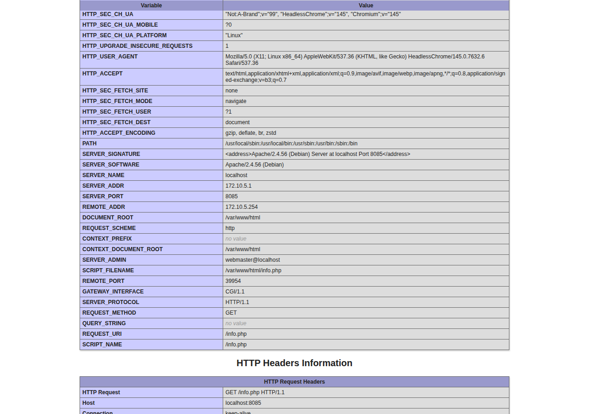
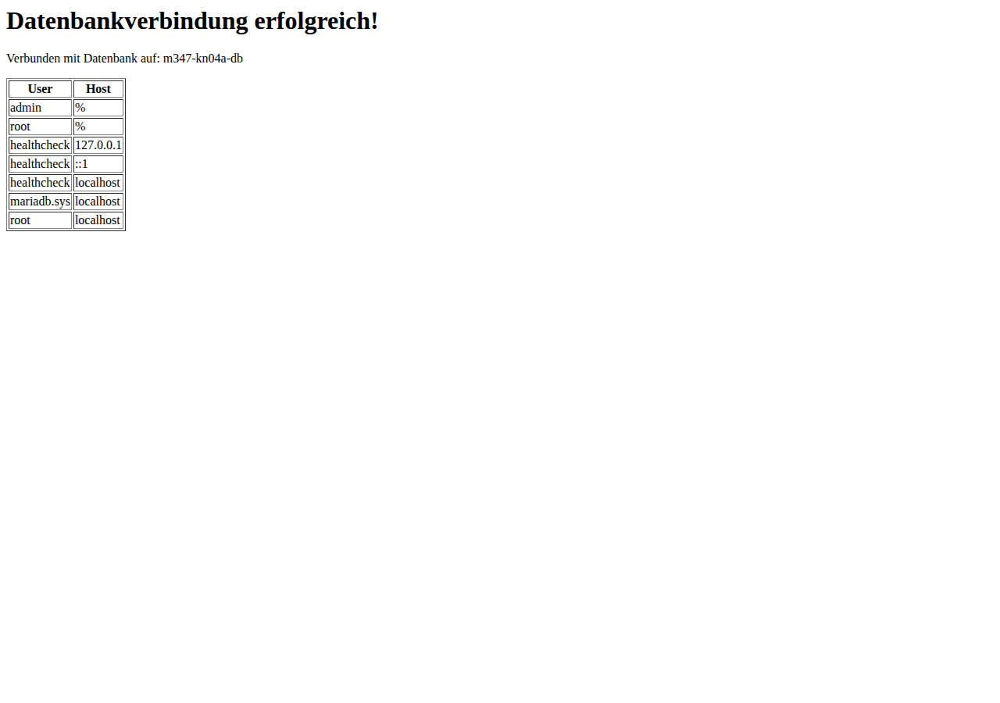

# KN04: Docker Compose

## A) Docker Compose: Lokal (60%)

### Teil a) Verwendung von Original Images

#### docker-compose.yml

```yaml
services:
  m347-kn04a-web:
    container_name: m347-kn04a-web
    build: .
    ports:
      - "8085:80"
    networks:
      - kn04a-net
    depends_on:
      - m347-kn04a-db

  m347-kn04a-db:
    container_name: m347-kn04a-db
    image: mariadb:latest
    environment:
      MYSQL_ROOT_PASSWORD: rootpassword
      MYSQL_DATABASE: mysql
      MYSQL_USER: admin
      MYSQL_PASSWORD: admin
    networks:
      - kn04a-net

networks:
  kn04a-net:
    driver: bridge
    ipam:
      config:
        - subnet: 172.10.0.0/16
          ip_range: 172.10.5.0/24
          gateway: 172.10.5.254
```

#### Dockerfile (Webserver)

```dockerfile
FROM php:8.0-apache
WORKDIR /var/www/html
COPY info.php .
COPY db.php .
RUN docker-php-ext-install mysqli
EXPOSE 80
```

#### Was macht `docker compose up`?

`docker compose up` führt intern folgende Befehle aus:

| Schritt | Befehl (intern) | Erklärung |
|---------|-----------------|-----------|
| 1 | `docker network create` | Erstellt alle definierten Netzwerke |
| 2 | `docker pull` | Lädt alle Images herunter die nicht lokal vorhanden sind |
| 3 | `docker build` | Baut alle Services die ein Dockerfile verwenden |
| 4 | `docker create` | Erstellt alle Container |
| 5 | `docker start` | Startet alle Container in der richtigen Reihenfolge (depends_on) |

Mit `-d` (detached) läuft alles im Hintergrund.

```bash
docker compose up -d
```

#### Abgaben

**Screenshot info.php (REMOTE_ADDR und SERVER_ADDR sichtbar):**



**Screenshot db.php:**



---

### Teil b) Verwendung eigener Images

#### docker-compose-b.yml

```yaml
services:
  m347-kn04b-web:
    container_name: m347-kn04b-web
    image: gonjpg/m347:kn02b-web
    ports:
      - "8086:80"
    networks:
      - kn04b-net
    depends_on:
      - m347-kn04b-db

  m347-kn04b-db:
    container_name: m347-kn04b-db
    image: gonjpg/m347:kn02b-db
    networks:
      - kn04b-net

networks:
  kn04b-net:
    driver: bridge
    ipam:
      config:
        - subnet: 172.11.0.0/16
          ip_range: 172.11.5.0/24
          gateway: 172.11.5.254
```

**Änderungen gegenüber Teil a:**
- Kein `build` mehr - stattdessen `image: gonjpg/m347:kn02b-web`
- Kein Dockerfile nötig
- Anderer IP-Range (172.11.0.0/16)

#### Erklärung des Fehlers bei db.php

Das eigene Image `gonjpg/m347:kn02b-web` enthält in `db.php` den Hostname `kn02b-db` (aus KN02). Der neue Container heisst aber `m347-kn04b-db`. Da der Hostname nicht stimmt, schlägt die Datenbankverbindung fehl.

**Lösung:** Den `$servername` in `db.php` auf `m347-kn04b-db` ändern und das Image neu bauen und pushen.

---

## B) Docker Compose: Cloud (40%)

> Hinweis: Für den Cloud-Teil wird eine AWS EC2 Instanz mit Cloud-Init benötigt.

#### cloud-init.yaml

```yaml
#cloud-config
users:
  - name: ubuntu
    sudo: ALL=(ALL) NOPASSWD:ALL
    groups: users, admin
    home: /home/ubuntu
    shell: /bin/bash
    ssh_authorized_keys:
      - ssh-rsa AAAA...  # Eigener Public Key
      - ssh-rsa AAAA...  # Public Key Lehrperson

package_update: true
package_upgrade: true

packages:
  - docker.io
  - docker-compose

write_files:
  - path: /home/ubuntu/docker-compose.yml
    content: |
      services:
        m347-kn04b-web:
          container_name: m347-kn04b-web
          image: gonjpg/m347:kn02b-web
          ports:
            - "80:80"
          networks:
            - kn04-net
          depends_on:
            - m347-kn04b-db

        m347-kn04b-db:
          container_name: m347-kn04b-db
          image: gonjpg/m347:kn02b-db
          networks:
            - kn04-net

      networks:
        kn04-net:
          driver: bridge
          ipam:
            config:
              - subnet: 172.10.0.0/16
                ip_range: 172.10.5.0/24
                gateway: 172.10.5.254

runcmd:
  - systemctl enable docker
  - systemctl start docker
  - usermod -aG docker ubuntu
  - cd /home/ubuntu && docker compose up -d

final_message: "Cloud-Init abgeschlossen - Docker Compose läuft!"
```
