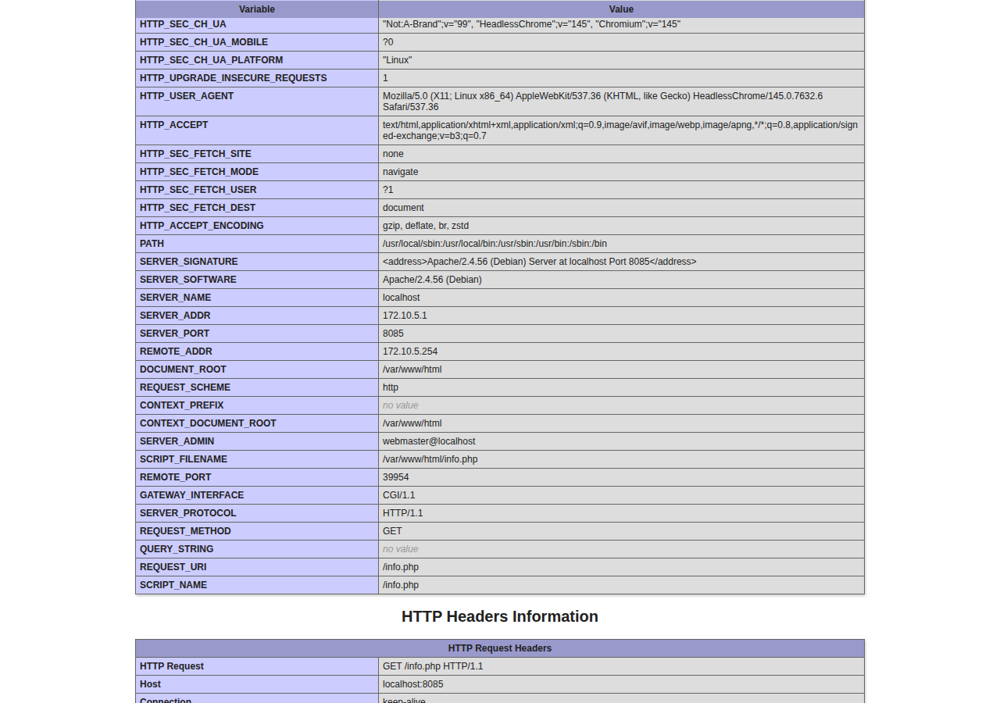
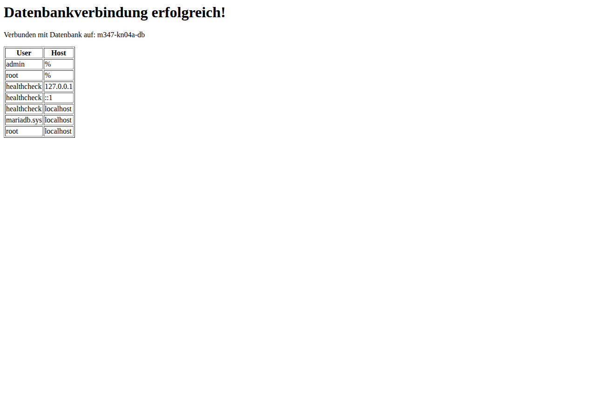
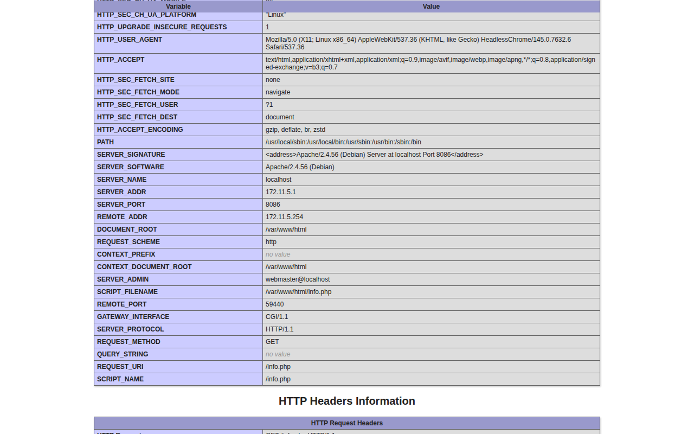
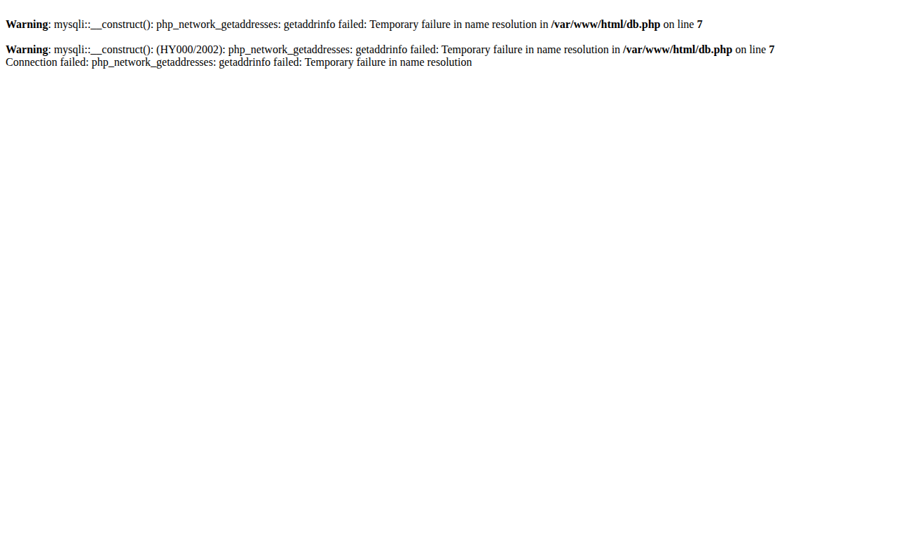
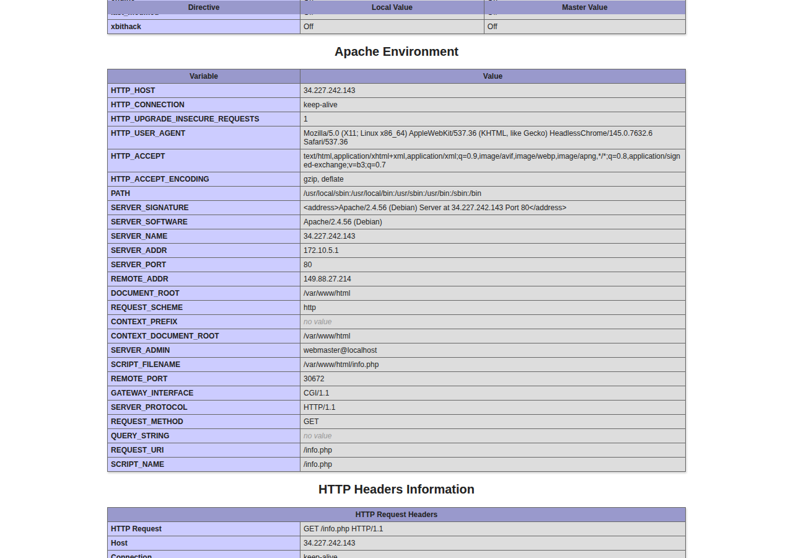
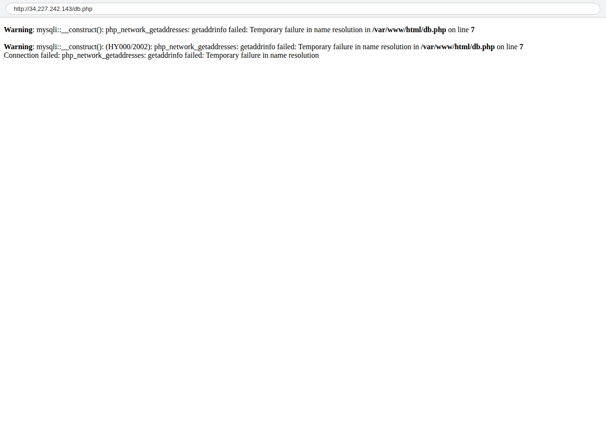

# KN04: Docker Compose

## A) Docker Compose: Lokal (60%)

### Teil a) Verwendung von Original Images

#### docker-compose.yml

```yaml
services:
  m347-kn04a-web:
    container_name: m347-kn04a-web
    build: .
    ports:
      - "8085:80"
    networks:
      - kn04a-net
    depends_on:
      - m347-kn04a-db

  m347-kn04a-db:
    container_name: m347-kn04a-db
    image: mariadb:latest
    environment:
      MYSQL_ROOT_PASSWORD: rootpassword
      MYSQL_DATABASE: mysql
      MYSQL_USER: admin
      MYSQL_PASSWORD: admin
    networks:
      - kn04a-net

networks:
  kn04a-net:
    driver: bridge
    ipam:
      config:
        - subnet: 172.10.0.0/16
          ip_range: 172.10.5.0/24
          gateway: 172.10.5.254
```

#### Dockerfile (Webserver)

```dockerfile
FROM php:8.0-apache
WORKDIR /var/www/html
COPY info.php .
COPY db.php .
RUN docker-php-ext-install mysqli
EXPOSE 80
```

#### Was macht `docker compose up`?

`docker compose up` führt intern folgende Befehle aus:

| Schritt | Befehl (intern) | Erklärung |
|---------|-----------------|-----------|
| 1 | `docker network create` | Erstellt alle definierten Netzwerke |
| 2 | `docker pull` | Lädt alle Images herunter die nicht lokal vorhanden sind |
| 3 | `docker build` | Baut alle Services die ein Dockerfile verwenden |
| 4 | `docker create` | Erstellt alle Container |
| 5 | `docker start` | Startet alle Container in der richtigen Reihenfolge (depends_on) |

Mit `-d` (detached) läuft alles im Hintergrund.

```bash
docker compose up -d
```

#### Abgaben

**Screenshot info.php (REMOTE_ADDR und SERVER_ADDR sichtbar):**



**Screenshot db.php:**



---

### Teil b) Verwendung eigener Images

#### docker-compose-b.yml

Die Datei liegt unter `kn04b/docker-compose-b.yml`.

```yaml
services:
  m347-kn04b-web:
    container_name: m347-kn04b-web
    image: gonjpg/m347:kn02b-web
    ports:
      - "8086:80"
    networks:
      - kn04b-net
    depends_on:
      - m347-kn04b-db

  m347-kn04b-db:
    container_name: m347-kn04b-db
    image: gonjpg/m347:kn02b-db
    networks:
      - kn04b-net

networks:
  kn04b-net:
    driver: bridge
    ipam:
      config:
        - subnet: 172.11.0.0/16
          ip_range: 172.11.5.0/24
          gateway: 172.11.5.254
```

**Änderungen gegenüber Teil a:**
- Kein `build` mehr - stattdessen `image: gonjpg/m347:kn02b-web`
- Kein Dockerfile nötig
- Anderer IP-Range (172.11.0.0/16)

```bash
docker compose -f kn04b/docker-compose-b.yml up -d
```

#### Abgaben

**Screenshot info.php (REMOTE_ADDR und SERVER_ADDR sichtbar):**



**Screenshot db.php (Fehler sichtbar):**



#### Erklärung des Fehlers bei db.php

Das eigene Image `gonjpg/m347:kn02b-web` enthält in `db.php` den Hostname `kn02b-db` (aus KN02). Der neue Container heisst aber `m347-kn04b-db`. Da der Hostname nicht übereinstimmt, schlägt die Datenbankverbindung fehl.

**Lösung:** Den `$servername` in `db.php` auf `m347-kn04b-db` ändern, das Image neu bauen und erneut auf Docker Hub pushen.

---

## B) Docker Compose: Cloud (40%)

EC2 Instanz gestartet mit Cloud-Init auf AWS (us-east-1). Die Instanz installiert automatisch Docker und startet die Container per `docker compose up -d`.

**Instanz-Details:**
- AMI: Ubuntu 22.04 LTS (ami-04680790a315cd58d)
- Typ: t2.micro
- Public IP: `34.227.242.143`
- Security Group: Port 22 (SSH) und Port 80 (HTTP) offen

#### cloud-init.yaml

Die vollständige Datei liegt unter `cloud-init.yaml`.

```yaml
#cloud-config
# source: https://gist.github.com/syntaqx/9dd3ff11fb3d48b032c84f3e31af9163
users:
  - name: ubuntu
    sudo: ALL=(ALL) NOPASSWD:ALL
    groups: users, admin, docker
    home: /home/ubuntu
    shell: /bin/bash
    ssh_authorized_keys:
      - ssh-rsa AAAAB3NzaC1yc2EAAAADAQABAAABAQCUBo+qnNu5xxM9vfz4C04M36FHxHNrEMdm5TkFj1/SfVtqunlUOeMpu7nFCZZKnX8HYwf/MkjcBiTYAgncxku8grwl6XuW/pcvmb6/ghSIaw4xtRRSzit7omqJ5d8kXB3+Nd1aaMHsjfly4nkaqswhySVXQqr8Hw6DbWVw8jLLVKEE+5NZHY33hJkhJwK4blCllsGpmQaKi1qxjsN0hZOWNK01iJAydwD8t2xJ0NOYbq8Qas5IyPnRN7SPxvEhIP6WLQ6Ym6Dmf8FwNW1cHLTKabgjzt5f/HKUkKS89dPd3fn4nnFli1BOMECGUIvVlOw2pQNri7+04OOfn2FGlqr5 teacher
      - ssh-ed25519 AAAAC3NzaC1lZDI1NTE5AAAAIBlRt5qcV1PgtYeRuug+oeSDhnusinuQdRM2KEJsVzjh goncalo.dealmeida@edu.tbz.ch

ssh_pwauth: false
disable_root: false

package_update: true
package_upgrade: true

groups:
  - docker

system_info:
  default_user:
    groups: [docker]

packages:
  - apt-transport-https
  - ca-certificates
  - curl
  - gnupg
  - lsb-release
  - unattended-upgrades

write_files:
  - path: /home/ubuntu/docker-compose.yml
    content: |
      services:
        m347-kn04b-web:
          container_name: m347-kn04b-web
          image: gonjpg/m347:kn02b-web
          ports:
            - "80:80"
          networks:
            - kn04-net
          depends_on:
            - m347-kn04b-db

        m347-kn04b-db:
          container_name: m347-kn04b-db
          image: gonjpg/m347:kn02b-db
          networks:
            - kn04-net

      networks:
        kn04-net:
          driver: bridge
          ipam:
            config:
              - subnet: 172.10.0.0/16
                ip_range: 172.10.5.0/24
                gateway: 172.10.5.254

runcmd:
  - mkdir -p /etc/apt/keyrings
  - curl -fsSL https://download.docker.com/linux/ubuntu/gpg | gpg --dearmor -o /etc/apt/keyrings/docker.gpg
  - echo "deb [arch=$(dpkg --print-architecture) signed-by=/etc/apt/keyrings/docker.gpg] https://download.docker.com/linux/ubuntu $(lsb_release -cs) stable" | tee /etc/apt/sources.list.d/docker.list > /dev/null
  - apt-get update
  - apt-get install -y docker-ce docker-ce-cli containerd.io docker-compose-plugin
  - systemctl enable docker
  - systemctl start docker
  - chown ubuntu:ubuntu /home/ubuntu/docker-compose.yml
  - cd /home/ubuntu && docker compose up -d

final_message: "The system is finally up, after $UPTIME seconds"
```

#### Abgaben

**Screenshot info.php auf EC2 (URL mit Public IP sichtbar, REMOTE_ADDR und SERVER_ADDR sichtbar):**



**Screenshot db.php auf EC2 (Fehler sichtbar, URL mit Public IP sichtbar):**


