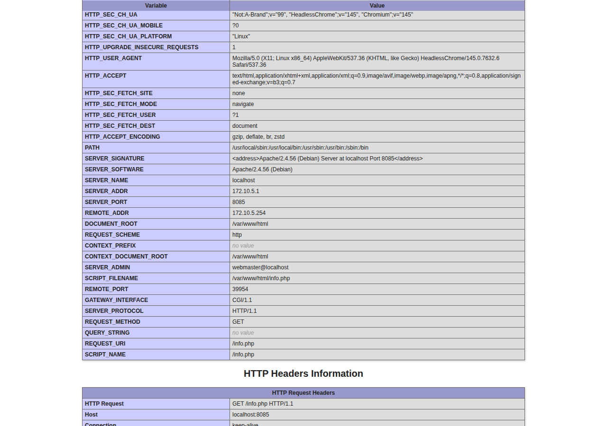
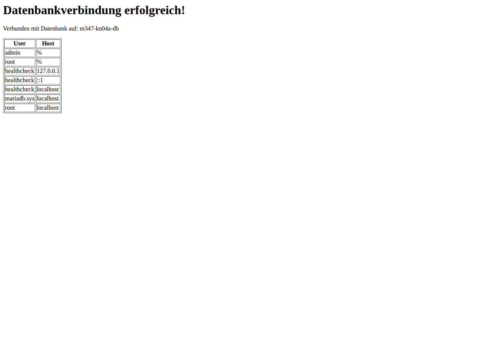
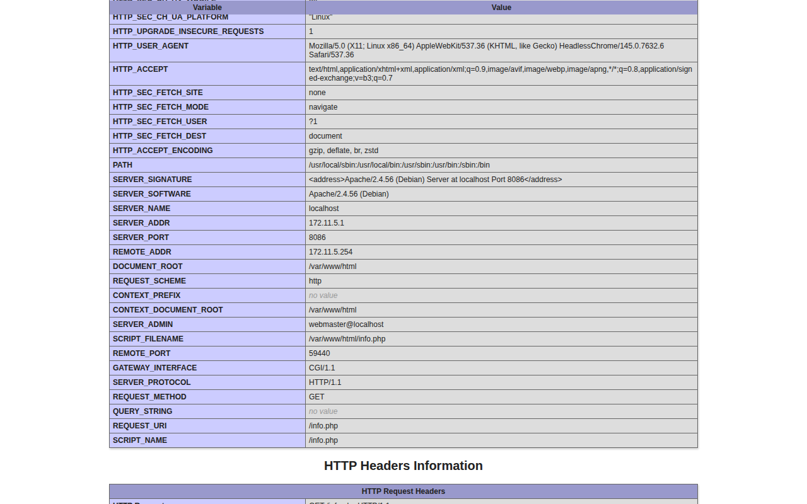
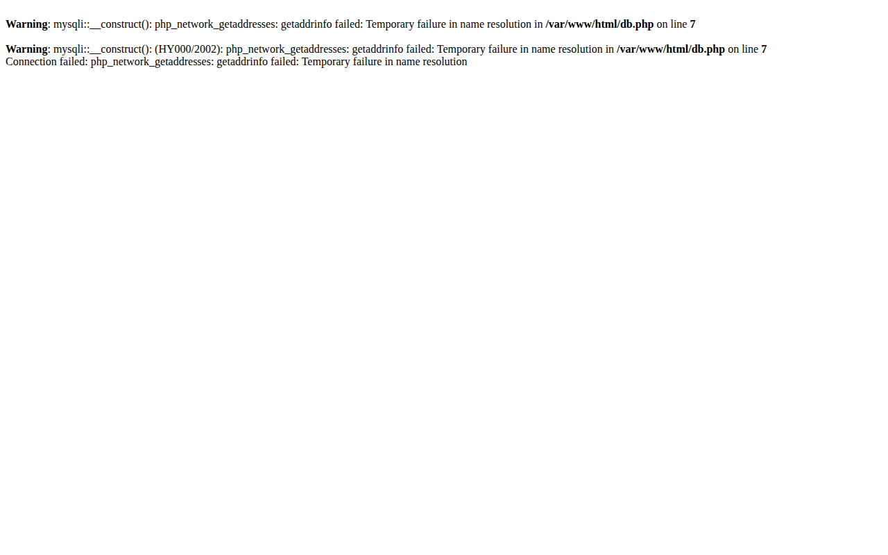
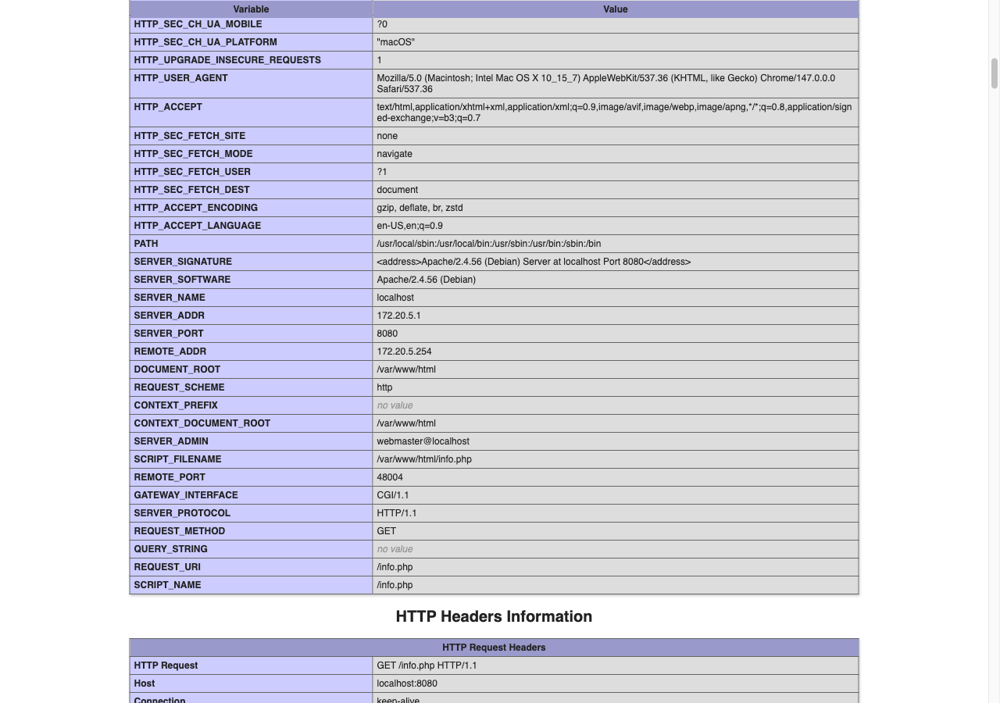
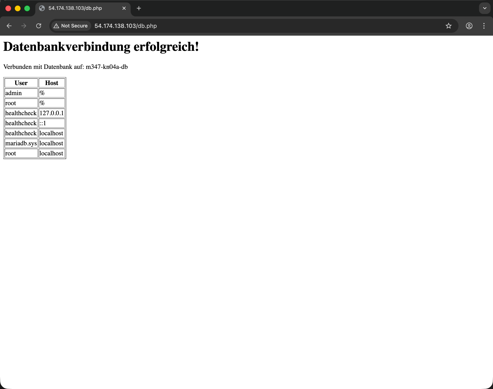

# KN04: Docker Compose

## A) Docker Compose: Lokal (60%)

### Teil a) Verwendung von Original Images

#### docker-compose.yml

```yaml
services:
  m347-kn04a-web:
    container_name: m347-kn04a-web
    build: .
    ports:
      - "8085:80"
    networks:
      - kn04a-net
    depends_on:
      - m347-kn04a-db

  m347-kn04a-db:
    container_name: m347-kn04a-db
    image: mariadb:latest
    environment:
      MYSQL_ROOT_PASSWORD: rootpassword
      MYSQL_DATABASE: mysql
      MYSQL_USER: admin
      MYSQL_PASSWORD: admin
    networks:
      - kn04a-net

networks:
  kn04a-net:
    driver: bridge
    ipam:
      config:
        - subnet: 172.10.0.0/16
          ip_range: 172.10.5.0/24
          gateway: 172.10.5.254
```

#### Dockerfile (Webserver)

```dockerfile
FROM php:8.0-apache
WORKDIR /var/www/html
COPY info.php .
COPY db.php .
RUN docker-php-ext-install mysqli
EXPOSE 80
```

#### Was macht `docker compose up`?

`docker compose up` führt intern folgende Befehle aus:

| Schritt | Befehl (intern) | Erklärung |
|---------|-----------------|-----------|
| 1 | `docker compose pull` | Lädt alle Images herunter die nicht lokal vorhanden sind |
| 2 | `docker compose build` | Baut alle Services die ein Dockerfile verwenden |
| 3 | `docker compose create` | Erstellt alle Container und Netzwerke |
| 4 | `docker compose start` | Startet alle Container in der richtigen Reihenfolge (depends_on) |

Mit `-d` (detached) läuft alles im Hintergrund.

```bash
docker compose up -d
```

#### Abgaben

**Screenshot info.php (REMOTE_ADDR und SERVER_ADDR sichtbar):**



**Screenshot db.php:**



---

### Teil b) Verwendung eigener Images

#### docker-compose-b.yml

Die Datei liegt unter `kn04b/docker-compose-b.yml`.

```yaml
services:
  m347-kn04b-web:
    container_name: m347-kn04b-web
    image: gonjpg/m347:kn02b-web
    ports:
      - "8086:80"
    networks:
      - kn04b-net
    depends_on:
      - m347-kn04b-db

  m347-kn04b-db:
    container_name: m347-kn04b-db
    image: gonjpg/m347:kn02b-db
    networks:
      - kn04b-net

networks:
  kn04b-net:
    driver: bridge
    ipam:
      config:
        - subnet: 172.11.0.0/16
          ip_range: 172.11.5.0/24
          gateway: 172.11.5.254
```

**Änderungen gegenüber Teil a:**
- Kein `build` mehr - stattdessen `image: gonjpg/m347:kn02b-web`
- Kein Dockerfile nötig
- Anderer IP-Range (172.11.0.0/16)

```bash
docker compose -f kn04b/docker-compose-b.yml up -d
```

#### Abgaben

**Screenshot info.php (REMOTE_ADDR und SERVER_ADDR sichtbar):**



**Screenshot db.php (Fehler sichtbar):**



#### Erklärung des Fehlers bei db.php

Das eigene Image `gonjpg/m347:kn02b-web` enthält in `db.php` den hardcodierten Hostname `kn02b-db` (aus KN02: `$servername = "kn02b-db"`). Der neue Container heisst aber `m347-kn04b-db`. Da der Hostname nicht übereinstimmt, kann der Webserver den DB-Container im Docker-Netzwerk nicht per DNS auflösen → Verbindung schlägt fehl.

**Einfachste Lösung:** Den DB-Service direkt so benennen wie der DNS-Name in `db.php`:

```yaml
services:
  web:
    image: gonjpg/m347:kn02b-web
    depends_on:
      - kn02b-db

  kn02b-db:                    # Service-Name = DNS-Name in db.php
    container_name: kn02b-db
    image: gonjpg/m347:kn02b-db
```

Docker registriert Services automatisch im internen DNS unter ihrem Service-Namen. Wenn der Service `kn02b-db` heisst, findet `db.php` den Container ohne Alias und ohne Image-Rebuild.

**Alternative Lösung:** Den `$servername` in `db.php` auf den neuen Container-Namen ändern, das Image neu bauen und auf Docker Hub pushen.

---

## B) Docker Compose: Cloud (40%)

EC2 Instanz gestartet mit Cloud-Init auf AWS (us-east-1). Die Instanz installiert automatisch Docker, schreibt `Dockerfile`, `info.php` und `db.php` ins Filesystem und startet die Container per `docker compose up -d --build`.

**Instanz-Details:**
- AMI: Ubuntu 22.04 LTS (ami-00403f401ee6a4b98)
- Typ: t2.micro
- Public IP: `54.174.138.103`
- Security Group: Port 22 (SSH) und Port 80 (HTTP) offen

#### Lösung: Lehrer-Feedback

> "Teil B sollten Sie natürlich die Konfiguration verwenden, die funktioniert. Also entweder über das Dockerfile oder über ein neu publiziertes Image. (Die einfachste Variante ist allerdings, den Namen im docker-compose auf den DNS zu setzen, den Sie im db.php verwenden.)"

Umgesetzt mit der **Dockerfile-Variante** in der Cloud: Das Web-Image wird auf der EC2-Instanz aus dem lokalen `Dockerfile` gebaut, dabei wird `db.php` mit `$servername = "m347-kn04a-db"` ins Image kopiert. Der DB-Container heisst exakt `m347-kn04a-db` (Service-Name + `container_name`). Damit findet der Webserver die Datenbank über Docker-Netzwerk-DNS und die Verbindung funktioniert.

#### cloud-init.yaml

Die vollständige Datei liegt unter `cloud-init.yaml`. Wichtigster Teil — `write_files` schreibt Dockerfile, info.php, db.php und docker-compose.yml; `runcmd` installiert Docker und baut den Stack:

```yaml
write_files:
  - path: /home/ubuntu/web/Dockerfile
    content: |
      FROM php:8.0-apache
      WORKDIR /var/www/html
      COPY info.php .
      COPY db.php .
      RUN docker-php-ext-install mysqli
      EXPOSE 80

  - path: /home/ubuntu/web/info.php
    content: |
      <?php
      phpinfo();
      ?>

  - path: /home/ubuntu/web/db.php
    content: |
      <?php
      $servername = "m347-kn04a-db";
      ...

  - path: /home/ubuntu/docker-compose.yml
    content: |
      services:
        m347-kn04a-web:
          container_name: m347-kn04a-web
          build: ./web
          ports:
            - "80:80"
          networks:
            - kn04-net
          depends_on:
            - m347-kn04a-db

        m347-kn04a-db:
          container_name: m347-kn04a-db
          image: mariadb:latest
          environment:
            MYSQL_ROOT_PASSWORD: rootpassword
            MYSQL_DATABASE: mysql
          networks:
            - kn04-net

      networks:
        kn04-net:
          driver: bridge
          ipam:
            config:
              - subnet: 172.20.0.0/16
                ip_range: 172.20.5.0/24
                gateway: 172.20.5.254

runcmd:
  - apt-get install -y docker-ce docker-ce-cli containerd.io docker-compose-plugin
  - systemctl enable docker && systemctl start docker
  - chown -R ubuntu:ubuntu /home/ubuntu/web
  - cd /home/ubuntu && docker compose up -d --build
```

#### Deploy-Befehl

```bash
aws ec2 run-instances \
  --image-id ami-00403f401ee6a4b98 \
  --instance-type t2.micro \
  --key-name kn04-key \
  --security-group-ids <SG_ID> \
  --user-data file://cloud-init.yaml
```

#### Abgaben

**Screenshot info.php auf EC2 (REMOTE_ADDR und SERVER_ADDR sichtbar):**



REMOTE_ADDR (`172.20.5.254`) und SERVER_ADDR (`172.20.5.x`) zeigen, dass der Request über das Docker-Bridge-Netzwerk `kn04-net` (Subnet 172.20.0.0/16) läuft.

**Screenshot db.php auf EC2 (Verbindung erfolgreich):**



Output: `Datenbankverbindung erfolgreich! Verbunden mit Datenbank auf: m347-kn04a-db` plus die User-Tabelle aus MariaDB. Der DB-Container wird via DNS-Name `m347-kn04a-db` gefunden — exakt wie in `db.php` hardcodiert.
