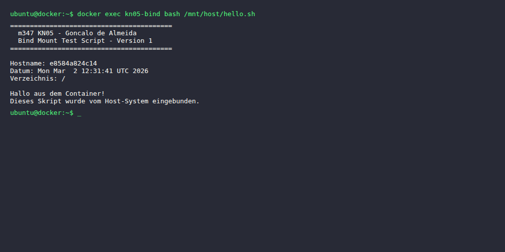
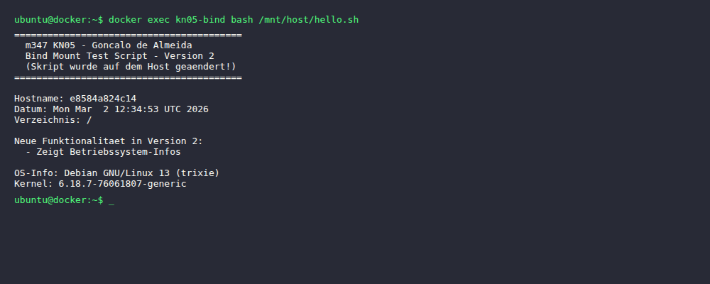
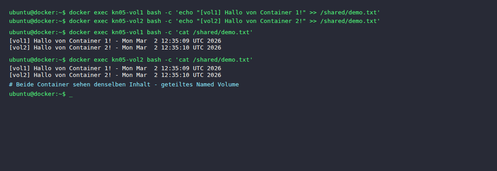
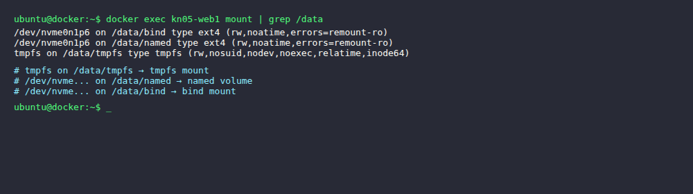
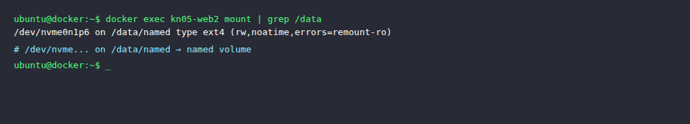

# KN05: Arbeit mit Speicher

## A) Bind Mounts (40%)

Ein Bind Mount verbindet ein Verzeichnis vom Host direkt in den Container. Änderungen auf dem Host sind sofort im Container sichtbar – ohne Rebuild.

### Befehle

```bash
# Container mit Bind Mount starten
docker run -d --name kn05-bind \
  -v /pfad/auf/host:/mnt/host \
  nginx:latest

# Skript im Container ausführen (liegt auf dem Host)
docker exec kn05-bind bash /mnt/host/hello.sh
```

### Ablauf

1. Container `kn05-bind` mit nginx-Image gestartet, Host-Verzeichnis `kn05a/` eingebunden unter `/mnt/host`
2. `hello.sh` (Version 1) auf dem Host erstellt und im Container ausgeführt
3. Skript auf dem Host zu Version 2 geändert (neue Infos hinzugefügt)
4. Gleicher Container ohne Rebuild erneut ausgeführt → Änderungen sofort sichtbar

**Screenshot Skript Version 1:**



**Screenshot Skript Version 2 (auf Host geändert, kein Rebuild):**



**Screencast des gesamten Prozesses:**

[Screencast Bind Mount (WebM)](./screenshots/a_bind_mount_screencast.webm)

---

## B) Named Volumes (30%)

Ein Named Volume wird von Docker verwaltet und kann von mehreren Containern gleichzeitig gemountet werden. Daten bleiben auch nach Container-Löschung erhalten.

### Befehle

```bash
# Named Volume erstellen
docker volume create kn05-shared

# Zwei Container mit demselben Volume starten
docker run -d --name kn05-vol1 -v kn05-shared:/shared nginx:latest
docker run -d --name kn05-vol2 -v kn05-shared:/shared nginx:latest

# Von vol1 schreiben
docker exec kn05-vol1 bash -c 'echo "[vol1] Hallo von Container 1!" >> /shared/demo.txt'

# Von vol2 schreiben
docker exec kn05-vol2 bash -c 'echo "[vol2] Hallo von Container 2!" >> /shared/demo.txt'

# Von vol1 lesen (sieht auch vol2-Eintrag)
docker exec kn05-vol1 bash -c 'cat /shared/demo.txt'

# Von vol2 lesen (sieht auch vol1-Eintrag)
docker exec kn05-vol2 bash -c 'cat /shared/demo.txt'
```

**Screenshot – beide Container schreiben und lesen denselben Inhalt:**



**Screencast des gesamten Prozesses:**

[Screencast Named Volume (WebM)](./screenshots/b_named_volume_screencast.webm)

---

## C) Speicher mit Docker Compose (30%)

### docker-compose.yml

Die Datei liegt unter `kn05c/docker-compose.yml`.

```yaml
services:
  kn05-web1:
    container_name: kn05-web1
    image: nginx:latest
    volumes:
      # Long syntax - named volume
      - type: volume
        source: kn05-named-vol
        target: /data/named
      # Long syntax - bind mount
      - type: bind
        source: ./bindmount
        target: /data/bind
      # Long syntax - tmpfs
      - type: tmpfs
        target: /data/tmpfs
    networks:
      - kn05-net

  kn05-web2:
    container_name: kn05-web2
    image: nginx:latest
    volumes:
      # Short syntax - named volume
      - kn05-named-vol:/data/named
    networks:
      - kn05-net

volumes:
  kn05-named-vol:
    driver: local

networks:
  kn05-net:
    driver: bridge
```

**Unterschied Long vs. Short Syntax:**
- **Long syntax**: Vollständige Konfiguration mit `type`, `source`, `target` – nötig für tmpfs (kein `source`)
- **Short syntax**: Kompaktes Format `volume:pfad` – für einfache Fälle ausreichend

### Abgaben

**`mount` im ersten Container (kn05-web1) – alle 3 Speichertypen sichtbar:**



**`mount` im zweiten Container (kn05-web2) – nur Named Volume:**


