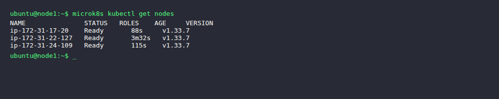
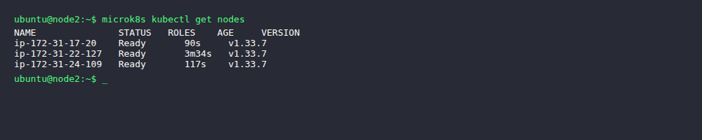
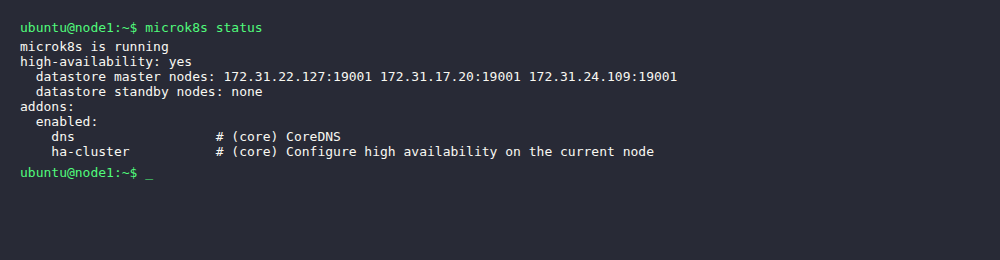
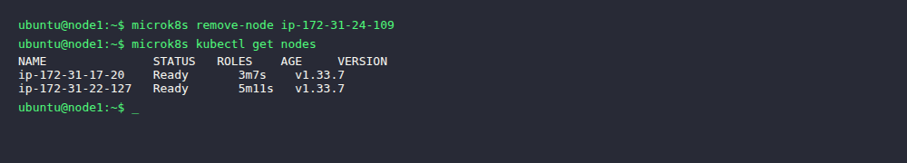
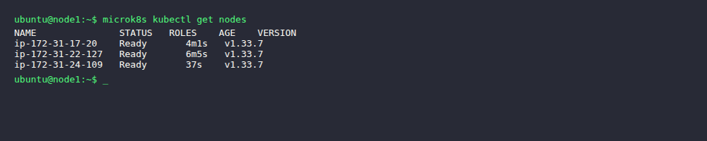
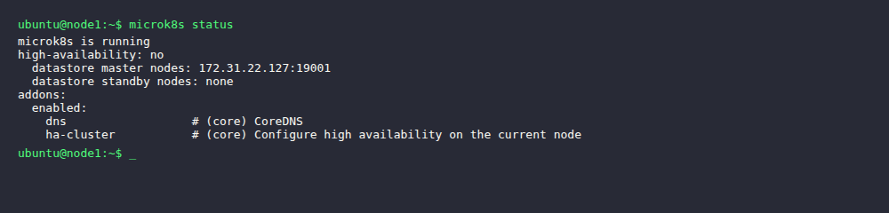
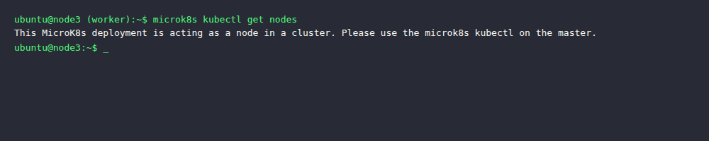

# KN06: Kubernetes I

## A) Installation (50%)

### Infrastruktur

Drei AWS EC2 Instanzen (t2.medium, Ubuntu 22.04, 30GB Disk) wurden mit dem offiziellen MicroK8s Cloud-Init gestartet. Cloud-Init installiert automatisch `microk8s` via snap.

**Instanzen:**
| Node | Private IP | Public IP | Rolle |
|------|-----------|-----------|-------|
| node1 (ip-172-31-22-127) | 172.31.22.127 | 54.80.188.88 | Master |
| node2 (ip-172-31-17-20) | 172.31.17.20 | 44.223.22.67 | Master |
| node3 (ip-172-31-24-109) | 172.31.24.109 | 3.81.227.219 | Worker |

**Cluster bilden:**
```bash
# Auf node1: Join-Token generieren
microk8s add-node

# Auf node2: dem Cluster beitreten
microk8s join 172.31.22.127:25000/<token>

# Auf node1: neues Token für node3
microk8s add-node

# Auf node3: dem Cluster beitreten
microk8s join 172.31.22.127:25000/<token>
```

**Screenshot `microk8s kubectl get nodes` auf node1 (alle 3 Nodes sichtbar):**



---

## B) Verständnis für Cluster (50%)

### Unterschied `microk8s` vs. `microk8s kubectl`

- **`microk8s`**: Verwaltet MicroK8s selbst – den Kubernetes-Dienst auf dem Node. Damit startet/stoppt man den Dienst, fügt Nodes hinzu/entfernt sie, aktiviert Addons, prüft den Status (`microk8s status`, `microk8s add-node`, `microk8s stop`).
- **`microk8s kubectl`**: Verwaltet den Kubernetes-**Cluster** – also Pods, Services, Deployments, Nodes aus Clustersicht. Es ist das Standard-Kubernetes-CLI (`kubectl`) eingebettet in MicroK8s.

Kurz: `microk8s` = Node-Verwaltung, `microk8s kubectl` = Cluster-Verwaltung.

---

### `microk8s kubectl get nodes` auf node2

Derselbe Befehl funktioniert von jedem Master-Node aus, da alle Master Zugriff auf den Datastore haben.



---

### `microk8s status` – Erklärung



**Erklärung:**
- `high-availability: yes` – mit 3 Nodes im Datastore ist HA aktiv. Fällt ein Master aus, übernehmen die anderen.
- `datastore master nodes: 172.31.22.127:19001 172.31.17.20:19001 172.31.24.109:19001` – alle 3 Nodes sind im Datenbank-Cluster (dqlite) und können den Cluster führen.
- `datastore standby nodes: none` – keine reinen Standby-Nodes.
- HA braucht mindestens 3 Nodes im Datastore (Quorum). Mit 3 Nodes kann 1 Node ausfallen ohne Datenverlust.

---

### Node entfernen

```bash
# Auf node3: den Cluster verlassen
microk8s leave

# Auf node1: Node aus der Liste entfernen
microk8s remove-node ip-172-31-24-109
```



---

### Node als Worker wieder hinzufügen

```bash
# Auf node1: neues Join-Token generieren
microk8s add-node

# Auf node3: als Worker beitreten (--worker Flag!)
microk8s join 172.31.22.127:25000/<token> --worker
```

**Cluster nach dem Wiederbeitreten als Worker:**



---

### `microk8s status` nach Worker-Join – Vergleich



**Unterschied und Grund:**
- Vorher: `high-availability: yes` – alle 3 Nodes waren im Datastore (3 Master)
- Nachher: `high-availability: no` – nur noch 2 Nodes im Datastore (`172.31.22.127` und `172.31.17.20`)
- **Grund:** Ein Worker-Node nimmt **nicht** am Datenbank-Cluster teil. Er führt nur Workload aus, hat aber keinen eigenen Datastore. Für HA braucht man mindestens 3 Datastore-Nodes.

---

### `microk8s kubectl get nodes` auf Master vs. Worker

**Auf Master (node1):** Funktioniert normal – Master hat Zugriff auf den API-Server.

**Auf Worker (node3):**



**Erklärung:** Ein Worker-Node führt nur Pods aus. Er hat keine lokale API-Server-Instanz und kann deshalb `microk8s kubectl` nicht direkt nutzen. Die Ausgabe `Please use the microk8s kubectl on the master` bestätigt dies. Das stimmt überein mit dem `microk8s status` Ergebnis: der Worker ist kein Datastore-Node.
