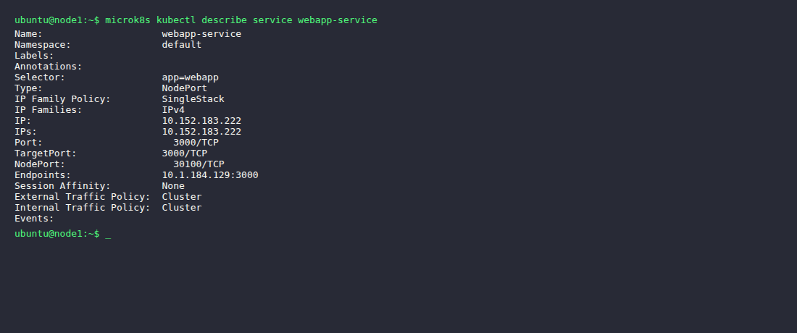
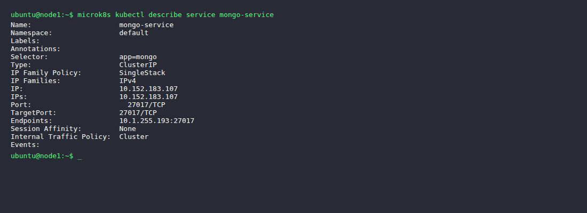
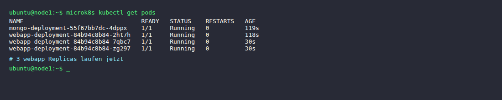
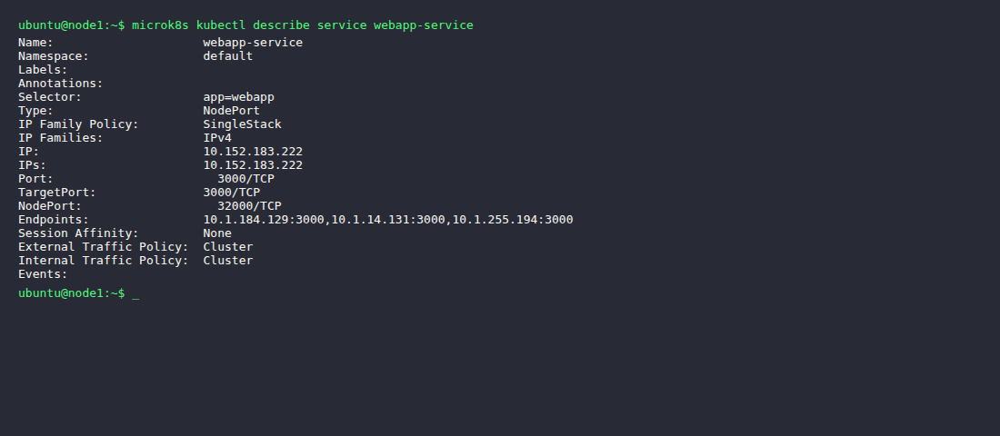
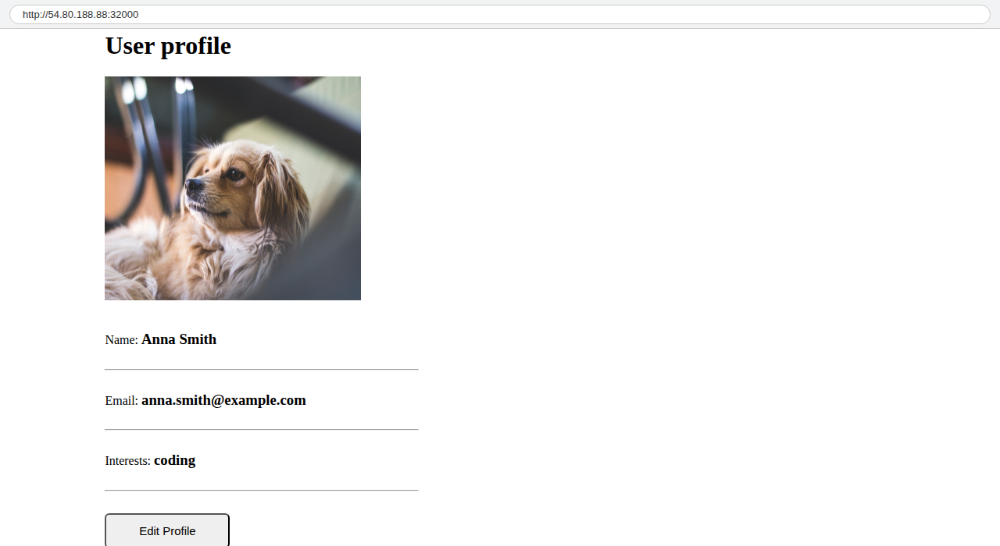

# KN07: Kubernetes II

## A) Begriffe und Konzepte (40%)

### Pods vs. Replicas

Ein **Pod** ist die kleinste Einheit in Kubernetes – er enthält einen oder mehrere Container, die zusammen laufen. Ein Pod hat eine eigene IP-Adresse und teilt sich Speicher und Netzwerk.

**Replicas** sind mehrere Kopien desselben Pods, die gleichzeitig laufen. Sie werden über ein Deployment gesteuert und dienen der Skalierung und Verfügbarkeit. Fällt ein Replica aus, erstellt Kubernetes automatisch einen neuen Pod.

Kurz: Ein Pod ist *eine* Instanz, Replicas definieren *wie viele* Instanzen laufen sollen.

### Service vs. Deployment

Ein **Deployment** beschreibt den gewünschten Zustand der Pods – welches Image, wie viele Replicas, welche Umgebungsvariablen usw. Es kümmert sich um das Erstellen, Aktualisieren und Skalieren von Pods.

Ein **Service** macht Pods im Netzwerk erreichbar. Pods bekommen bei jedem Neustart neue IPs – der Service bietet eine stabile IP und einen DNS-Namen, über den die Pods immer erreichbar sind. Er fungiert als Load Balancer zwischen den Replicas.

Kurz: Deployment = *was* läuft, Service = *wie* man es erreicht.

### Was löst Ingress?

Ingress löst das Problem, dass man von aussen auf Services im Cluster zugreifen will. Ohne Ingress müsste man für jeden Service einen eigenen NodePort oder LoadBalancer erstellen. Ingress funktioniert wie ein Reverse Proxy: es nimmt HTTP/HTTPS-Anfragen entgegen und leitet sie anhand von Hostnames oder URL-Pfaden an die richtigen internen Services weiter. So kann man z.B. `app.example.com` und `api.example.com` über einen einzigen Eintrittspunkt auf verschiedene Services routen.

### StatefulSet

Ein **StatefulSet** wird für Anwendungen verwendet, die einen stabilen Zustand brauchen – also eine feste Identität (z.B. immer denselben Hostnamen) und persistenten Speicher. Anders als bei einem Deployment werden die Pods in einer bestimmten Reihenfolge gestartet und gestoppt, und jeder Pod behält seinen Namen (z.B. `pod-0`, `pod-1`).

**Beispiel ohne Datenbank:** Ein Apache Kafka-Cluster. Jeder Kafka-Broker braucht eine feste ID, einen stabilen Hostnamen und persistenten Speicher für seine Log-Partitionen. Mit einem StatefulSet behält jeder Broker seine Identität auch nach einem Neustart.

---

## B) Demo Projekt (60%)

### Datenbank als Deployment statt StatefulSet

In Teil A wurde erklärt, dass für Datenbanken eigentlich ein **StatefulSet** verwendet werden sollte (feste Identität, persistenter Speicher). In diesem Demo-Projekt haben wir die MongoDB aber als **Deployment** umgesetzt. Das ist für ein Demo ok, weil wir nur 1 Replica haben und keine persistenten Daten brauchen. In der Produktion wäre das problematisch – bei einem Pod-Neustart gehen alle Daten verloren und es gibt keinen stabilen Hostnamen für die DB-Instanz.

### MongoUrl in der ConfigMap

```yaml
data:
  mongo-url: mongo-service
```

Der Wert `mongo-service` ist korrekt, weil Kubernetes automatisch DNS-Einträge für jeden Service erstellt. Der Service heisst `mongo-service` (definiert in `metadata.name` im mongo.yaml). Innerhalb des Clusters kann jeder Pod die MongoDB über `mongo-service:27017` erreichen. Die WebApp bekommt diesen Wert als Umgebungsvariable `DB_URL` und baut damit die Verbindungs-URL auf.

### `describe service webapp-service` auf Node 1



### `describe service webapp-service` auf Node 2


### `describe service mongo-service`



### Unterschiede zwischen den Services

| Eigenschaft | webapp-service | mongo-service |
|---|---|---|
| Type | **NodePort** | **ClusterIP** |
| NodePort | 30100 | – |
| External Traffic Policy | Cluster | – |
| Port | 3000/TCP | 27017/TCP |

**Erklärung:** Der webapp-service ist vom Typ `NodePort` – er ist von aussen über die Node-IP + Port 30100 erreichbar. Der mongo-service ist vom Typ `ClusterIP` (Standard) – er ist nur innerhalb des Clusters erreichbar. Das ist gewollt: die Datenbank soll nicht von aussen zugänglich sein.

### WebApp aufrufen

Die WebApp ist über `NodePort 30100` auf jedem Node des Clusters erreichbar. Man muss die öffentliche IP eines Nodes mit Port 30100 aufrufen, z.B. `http://54.80.188.88:30100`.

Da der Service vom Typ `NodePort` ist, leitet Kubernetes den Traffic automatisch an den richtigen Pod weiter – egal auf welchem Node der Pod läuft.

**Screenshot von Node 1:**


**Screenshot von Node 2:**


### MongoDB Compass Verbindung

Von aussen kann man sich **nicht** mit MongoDB verbinden, weil der `mongo-service` vom Typ **ClusterIP** ist. ClusterIP bedeutet, dass der Service nur innerhalb des Clusters eine IP hat – von aussen ist er nicht erreichbar.

**Lösung:** Den `mongo-service` Type auf `NodePort` ändern und einen NodePort (z.B. 30017) definieren:
```yaml
spec:
  type: NodePort
  ports:
    - port: 27017
      targetPort: 27017
      nodePort: 30017
```
Dann könnte man mit MongoDB Compass auf `<Node-IP>:30017` zugreifen. In der Praxis sollte man das nicht machen (Sicherheitsrisiko), sondern einen SSH-Tunnel oder VPN verwenden.

### Port und Replicas ändern

**Durchgeführte Schritte:**
1. `webapp.yaml` geändert: `replicas: 1` → `replicas: 3` und `nodePort: 30100` → `nodePort: 32000`
2. `microk8s kubectl apply -f webapp.yaml` ausgeführt
3. Kubernetes erstellt automatisch 2 neue Pods (total 3) und aktualisiert den Service

**Screenshot Pods (3 Replicas):**



**Screenshot `describe service webapp-service` (3 Endpoints + Port 32000):**



**Unterschied bei den Replicas:** In der `Endpoints`-Zeile sind jetzt 3 IP-Adressen sichtbar statt vorher nur 1. Jede IP gehört zu einem der 3 webapp-Pods. Der Service verteilt den Traffic gleichmässig auf alle 3.

**WebApp auf Port 32000:**


