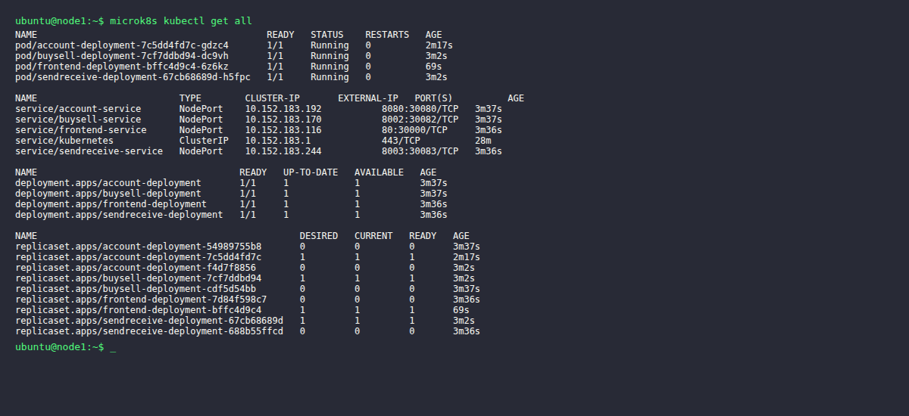
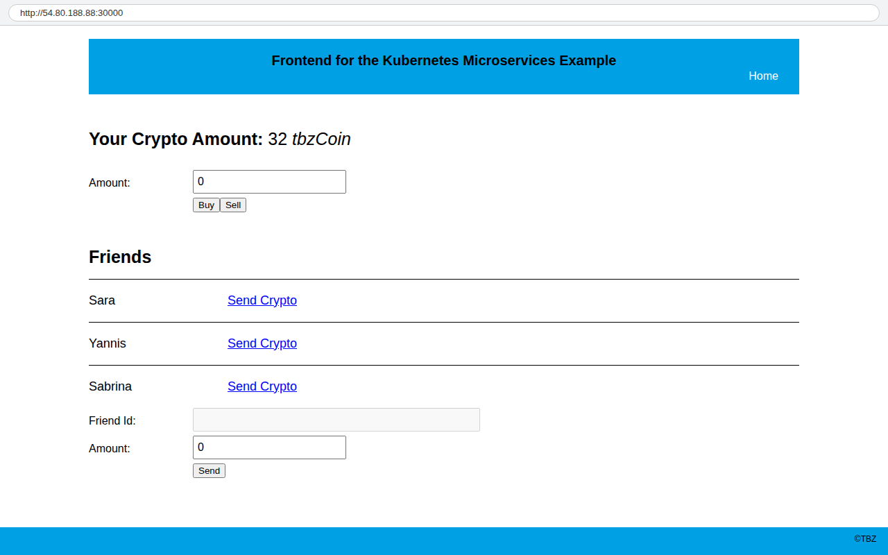
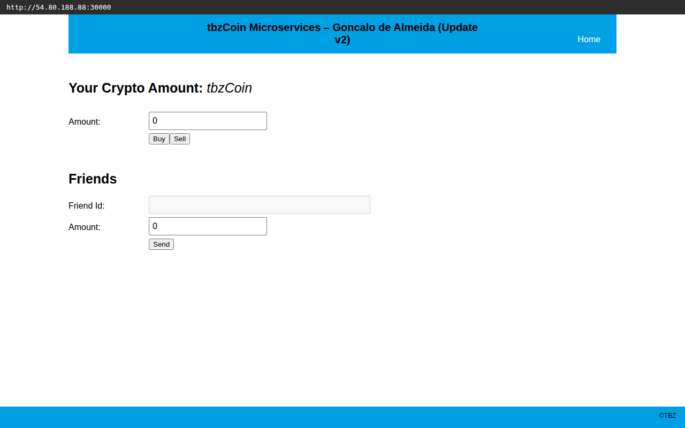

# KN08: Kubernetes III - Microservices

## Übersicht

In diesem Auftrag wurde eine Microservice-Applikation aufgebaut. Das System besteht aus 4 Komponenten:

- **Frontend** (React App) – vorgegeben, zeigt Crypto-Holdings und Freunde an
- **Account** (.NET Service) – vorgegeben, verwaltet Benutzer, Holdings und Freunde in der DB
- **BuySell** (Node.js) – selbst implementiert, für Kauf/Verkauf von tbzCoins
- **SendReceive** (Node.js) – selbst implementiert, für Transfer von tbzCoins an Freunde

Die Datenbank läuft als AWS RDS MariaDB. Das ganze System wird auf dem MicroK8s-Cluster (3 Nodes) aus KN06 gehostet.

---

## 1) Datenbank erstellen

Die Datenbank wurde als **AWS RDS MariaDB** Instanz erstellt:

- Endpoint: `m347-kn08-db.ctme48qugb7v.us-east-1.rds.amazonaws.com`
- DB-Name: `m347kn08`
- User: `admin`

Das SQL-Skript (`m347_KN08_DB.sql`) erstellt zwei Tabellen:
- `users` – Benutzer mit ID, Name und Coin-Anzahl (5 Einträge)
- `friends` – Freundschafts-Beziehungen (7 Einträge)

Die Daten wurden direkt per `mysql`-CLI auf dem Cluster geladen.

---

## 2) Frontend builden und containerisieren

Das Frontend ist eine React App. Die API-URLs werden als Environment Variables im `.env.production` definiert und beim Build hardcodiert:

```
REACT_APP_ACCOUNT_HOLDINGS=http://54.80.188.88:30080/Account/Cryptos/?userid=<userId>
REACT_APP_ACCOUNT_FRIENDS=http://54.80.188.88:30080/Account/Friends/?userid=<userId>
REACT_APP_BUYSELL_BUY=http://54.80.188.88:30082/buy
REACT_APP_BUYSELL_SELL=http://54.80.188.88:30082/sell
REACT_APP_SENDRECEIVE_SEND=http://54.80.188.88:30083/send
REACT_APP_USER_LOGGED_IN=1
```

Die URLs zeigen auf die öffentliche IP von Node 1 mit den entsprechenden NodePorts.

**Dockerfile:**
```dockerfile
FROM nginx  
WORKDIR /usr/share/nginx/html
COPY app/build/ .
EXPOSE 80
```

Build und Push:
```bash
npm run build    # im app/ Verzeichnis
docker build -t gonjpg/m347:kn08-frontend .
docker push gonjpg/m347:kn08-frontend
```

---

## 3) Account Komponente containerisieren

Der Account Service ist eine vorkompilierte .NET-Applikation. Die Verbindung zur DB wird über `appsettings.json` konfiguriert.

**Dockerfile:**
```dockerfile
FROM mcr.microsoft.com/dotnet/aspnet:8.0-alpine
WORKDIR /App
COPY bin .
EXPOSE 8080
ENTRYPOINT ["dotnet", "/App/account.dll"]
```

**Wichtig:** Die `appsettings.json` wird in Kubernetes nicht ins Image gebacken, sondern über eine ConfigMap als Volume eingebunden. So kann die DB-Verbindung ohne Rebuild geändert werden.

Build und Push:
```bash
docker build -t gonjpg/m347:kn08-account .
docker push gonjpg/m347:kn08-account
```

---

## 6) BuySell und SendReceive implementieren

Beide Services wurden in **Node.js mit Express** geschrieben und kommunizieren direkt mit der RDS MariaDB (via `mysql2`-Treiber).

### BuySell

Dateien: `buysell/server.js`, `buysell/Dockerfile`, `buysell/package.json`

Endpoints:
- `POST /buy` – kauft tbzCoins (erhöht Amount in DB)
- `POST /sell` – verkauft tbzCoins (reduziert Amount, minimum 0)
- `GET /health` – Health Check

Die Logik: Bei `/buy` wird einfach der Betrag zum aktuellen Amount addiert. Bei `/sell` wird geprüft wie viel der Benutzer hat, und das neue Total wird auf `max(0, current - amount)` gesetzt.

```javascript
// Auszug aus server.js (Buy)
app.post('/buy', async (req, res) => {
  const { id, amount } = req.body;
  const conn = await getConnection();
  await conn.execute('UPDATE users SET amount = amount + ? WHERE id = ?', [amount, id]);
  await conn.end();
  res.json(true);
});
```

**Dockerfile:**
```dockerfile
FROM node:18-alpine
WORKDIR /app
COPY package.json .
RUN npm install --production
COPY server.js .
EXPOSE 8002
CMD ["node", "server.js"]
```

### SendReceive

Dateien: `sendreceive/server.js`, `sendreceive/Dockerfile`, `sendreceive/package.json`

Endpoint:
- `POST /send` – überweist tbzCoins an einen Freund
- `GET /health` – Health Check

Die Logik: Zuerst wird geprüft ob der Empfänger ein Freund ist (`friends`-Tabelle), dann ob der Sender genug Coins hat. Falls ja, wird abgezogen und gutgeschrieben.

```javascript
// Auszug aus server.js (Send)
app.post('/send', async (req, res) => {
  const { id, receiverId, amount } = req.body;
  // 1. Freundschaft prüfen
  // 2. Balance prüfen
  // 3. Transfer ausführen
  await conn.execute('UPDATE users SET amount = amount - ? WHERE id = ?', [amount, senderId]);
  await conn.execute('UPDATE users SET amount = amount + ? WHERE id = ?', [amount, recId]);
  res.json(true);
});
```

Build und Push:
```bash
docker build -t gonjpg/m347:kn08-buysell ./buysell
docker push gonjpg/m347:kn08-buysell

docker build -t gonjpg/m347:kn08-sendreceive ./sendreceive
docker push gonjpg/m347:kn08-sendreceive
```

---

## 7) Kubernetes Realisieren

Die gesamte Applikation wurde auf dem bestehenden 3-Node MicroK8s-Cluster (aus KN06) deployed.

### ConfigMap

Zwei ConfigMaps:
1. `kn08-config` – enthält DB-Host, DB-Name und Account-URL für die Node.js Services
2. `account-appsettings` – enthält die komplette `appsettings.json` für den .NET Account Service

```yaml
apiVersion: v1
kind: ConfigMap
metadata:
  name: kn08-config
data:
  account-url: "http://account-service:8080"
  db-host: "m347-kn08-db.ctme48qugb7v.us-east-1.rds.amazonaws.com"
  db-name: "m347kn08"
```

Der Account Service liest seinen Connection String nicht aus Umgebungsvariablen, sondern aus der Datei `appsettings.json`. Deshalb wird die zweite ConfigMap als Volume gemountet:

```yaml
volumeMounts:
  - name: appsettings-volume
    mountPath: /App/appsettings.json
    subPath: appsettings.json
volumes:
  - name: appsettings-volume
    configMap:
      name: account-appsettings
```

### Secret

Das Secret `kn08-secret` speichert die DB-Zugangsdaten Base64-kodiert:

```yaml
apiVersion: v1
kind: Secret
metadata:
  name: kn08-secret
type: Opaque
data:
  db-user: YWRtaW4=           # admin
  db-password: bTM0N3Bhc3N3b3Jk   # m347password
```

### Deployments

4 Deployments mit je 1 Replica:

| Deployment | Image | Port |
|---|---|---|
| frontend-deployment | `gonjpg/m347:kn08-frontend` | 80 |
| account-deployment | `gonjpg/m347:kn08-account` | 8080 |
| buysell-deployment | `gonjpg/m347:kn08-buysell` | 8002 |
| sendreceive-deployment | `gonjpg/m347:kn08-sendreceive` | 8003 |

BuySell und SendReceive bekommen ihre Konfiguration über Env-Variablen aus ConfigMap und Secret:

```yaml
env:
  - name: DB_HOST
    valueFrom:
      configMapKeyRef:
        name: kn08-config
        key: db-host
  - name: DB_USER
    valueFrom:
      secretKeyRef:
        name: kn08-secret
        key: db-user
```

### Services

Alle Services sind vom Typ **NodePort**, damit sie von aussen erreichbar sind:

| Service | NodePort | Interner Port |
|---|---|---|
| frontend-service | 30000 | 80 |
| account-service | 30080 | 8080 |
| buysell-service | 30082 | 8002 |
| sendreceive-service | 30083 | 8003 |

### Deployment-Befehle

```bash
microk8s kubectl apply -f configmap.yaml
microk8s kubectl apply -f secret.yaml
microk8s kubectl apply -f deployments.yaml
microk8s kubectl apply -f services.yaml
```

### kubectl get all

Alle 4 Pods laufen, alle Services sind aktiv:



### Frontend im Browser

Die App ist unter `http://54.80.188.88:30000` erreichbar. Man sieht den eingeloggten Benutzer (Rene) mit seinen tbzCoins, die Buy/Sell-Funktion und die Freundesliste mit Send-Funktion:



---

## Alle YAML-Dateien

Die Kubernetes-Dateien liegen im Ordner `kubernetes/`:
- `configmap.yaml` – beide ConfigMaps
- `secret.yaml` – DB-Zugangsdaten
- `deployments.yaml` – alle 4 Deployments
- `services.yaml` – alle 4 Services

Die Dockerfiles und Source-Dateien der selbst implementierten Services liegen in `buysell/` und `sendreceive/`.

Alle Images sind auf Docker Hub unter `gonjpg/m347` gepusht:
- `gonjpg/m347:kn08-frontend`
- `gonjpg/m347:kn08-account`
- `gonjpg/m347:kn08-buysell`
- `gonjpg/m347:kn08-sendreceive`

---

## 8) App Update – Rolling Deployment ohne Downtime

Um zu zeigen, wie einfach ein Update in Kubernetes ausgerollt werden kann, wurde der Titel der Frontend-Applikation geändert.

### Schritt 1: Applikation ändern

In `frontend/app/src/App.js` wurde der Header-Text geändert:

```js
// Vorher:
<div>Frontend for the Kubernetes Microservices Example</div>

// Nachher:
<div>tbzCoin Microservices – Goncalo de Almeida (Update v2)</div>
```

### Schritt 2: Image neu bauen und pushen

```bash
cd frontend/app
npm run build

cd ..
docker build -t gonjpg/m347:kn08-frontend-v2 .
docker push gonjpg/m347:kn08-frontend-v2
```

### Schritt 3: Deployment-Konfiguration aktualisieren

In `kubernetes/deployments.yaml` wurde das Image für das Frontend-Deployment geändert:

```yaml
# Vorher:
image: gonjpg/m347:kn08-frontend

# Nachher:
image: gonjpg/m347:kn08-frontend-v2
```

### Schritt 4: Deployment neu anwenden

```bash
microk8s kubectl apply -f kubernetes/deployments.yaml
```

Kubernetes fährt automatisch den alten Pod herunter und startet den neuen mit dem aktualisierten Image. Während dieser Zeit bleibt die Applikation erreichbar – **kein Downtime**.

### Ergebnis



Der neue Titel ist sichtbar. Das Update wurde ohne Unterbruch ausgerollt.
